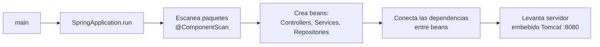
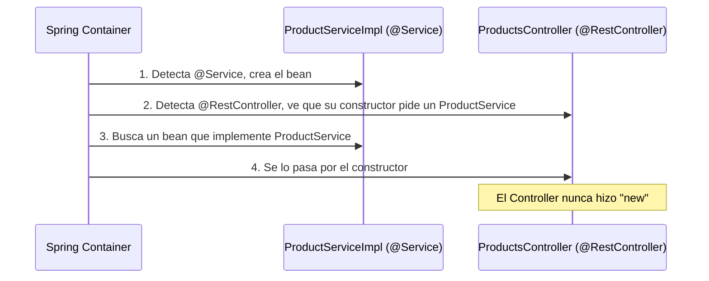

# Fase 2 — Spring Boot: arranque e inyección de dependencias

> La magia que hace que tu clase Java se convierta en un servidor que responde peticiones.

---

## 1. `@SpringBootApplication` — qué pasa al arrancar

```java
@SpringBootApplication
public class Fundamentos01Application {
    public static void main(String[] args) {
        SpringApplication.run(Fundamentos01Application.class, args);
    }
}
```

Es **3 anotaciones en una**:

| Anotación incluida | Qué hace |
|---|---|
| `@Configuration` | Esta clase puede definir beans (objetos que Spring gestiona). |
| `@EnableAutoConfiguration` | Spring adivina qué configurar según lo que hay en el classpath (ej: si ve PostgreSQL driver, configura un `DataSource`). |
| `@ComponentScan` | Escanea el paquete actual **y todos sus subpaquetes** buscando clases anotadas (`@Controller`, `@Service`, `@Repository`...) para registrarlas.



> **Idea clave:** todo lo que arranca es una clase que Spring **encontró y registró como bean**. Si una clase no está anotada (o no está bajo el paquete escaneado), Spring no sabe que existe.

---

## 2. Anotaciones de un Controller REST

```java
@RestController
@RequestMapping("/products")
public class ProductsController {

    @GetMapping("/{id}")
    public Object findOne(@PathVariable Long id) { ... }

    @PostMapping
    @ResponseStatus(HttpStatus.CREATED)
    public ProductResponseDto create(@Valid @RequestBody CreateProductDto dto) { ... }
}
```

| Anotación | Nivel | Qué hace |
|---|---|---|
| `@RestController` | Clase | = `@Controller` + `@ResponseBody`. Cada método devuelve datos (se serializan a JSON), no una vista HTML. |
| `@RequestMapping("/products")` | Clase | Prefijo común para **todas** las rutas del controller. |
| `@GetMapping` / `@PostMapping` / `@PutMapping` / `@PatchMapping` / `@DeleteMapping` | Método | Atajos de `@RequestMapping(method = ...)`. El nombre ya dice el verbo HTTP que atienden. |

**Ruta final = prefijo de clase + ruta de método.**
`@RequestMapping("/products")` + `@GetMapping("/{id}")` → `GET /products/{id}`.

---

## 3. `@PathVariable` vs `@RequestParam` vs `@RequestBody`

| Anotación | De dónde saca el dato | Ejemplo de URL/petición | Uso típico |
|---|---|---|---|
| `@PathVariable` | Un segmento **de la ruta** | `GET /products/42` → `id = 42` | Identificar un recurso puntual. |
| `@RequestParam` | Query string (`?clave=valor`) | `GET /products/page?page=0&size=5` | Filtros, paginación, valores opcionales. |
| `@RequestBody` | El **cuerpo** JSON de la petición | `POST /products` con `{ "name": "...", "price": 10 }` | Enviar un objeto completo (crear/actualizar). |

```java
@GetMapping("/{id}")
public Object findOne(@PathVariable Long id) { ... }              // /products/42

@PostMapping
public ProductResponseDto create(@Valid @RequestBody CreateProductDto dto) { ... } // body JSON
```

> Este proyecto usa `@ModelAttribute` para la paginación (`?page=0&size=5&sortBy=price`) en vez de varios `@RequestParam` sueltos — agrupa los parámetros en un DTO (`PaginationDto`).

---

## 4. Inyección de dependencias: cómo llega un `@Service` sin `new`

```java
@RestController
@RequestMapping("/products")
public class ProductsController {

    private final ProductService productService;

    public ProductsController(ProductService productService) {
        this.productService = productService;
    }
}
```

Nadie escribió `new ProductsController(new ProductServiceImpl(...))`. Pasa esto:



**Reglas rápidas:**

- Si solo hay **un constructor**, Spring no necesita `@Autowired` explícito (constructor injection implícita).
- Spring busca por **tipo** (`ProductService`, la interfaz). Si hay más de una implementación, hay que desambiguar con `@Qualifier` o `@Primary`.
- Los beans son (por defecto) **singleton**: se crean una vez al arrancar y se reutilizan en toda la app.
- Por qué inyectar por **constructor** y no por campo (`@Autowired` en el atributo): permite marcar el campo `final`, deja explícitas las dependencias, y facilita testear pasando mocks al constructor.

---

## Resumen / Chuleta

| Pregunta | Respuesta corta |
|---|---|
| ¿Qué hace `@SpringBootApplication`? | Escanea paquetes, crea y conecta los beans, levanta el servidor embebido. |
| ¿Qué convierte una clase en endpoint REST? | `@RestController` + `@RequestMapping`/`@GetMapping` etc. |
| ¿Dato en la URL o en el body? | Ruta → `@PathVariable`. Query string → `@RequestParam`. JSON del body → `@RequestBody`. |
| ¿Cómo llega un Service a un Controller? | Spring lo inyecta por el **constructor**, buscando un bean del tipo pedido. |

---

## Checklist

- [ ] Sé qué hacen `@RestController` y `@RequestMapping`
- [ ] Sé cuándo usar `@PathVariable`, `@RequestParam` y `@RequestBody`
- [ ] Entiendo cómo un `@Service` llega al constructor de un Controller
- [ ] Creé un controller nuevo desde cero sin copiar el mío
