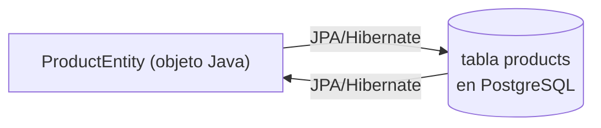
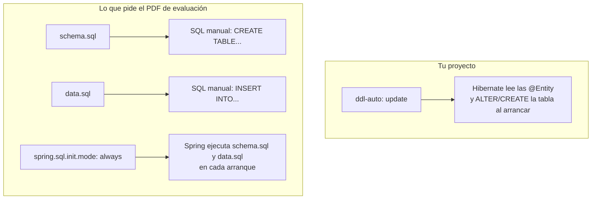

# Fase 3 — Persistencia: JPA, Entities y PostgreSQL

> La fase más pesada, y la que tiene una diferencia real con tu proyecto: la evaluación siembra datos con `schema.sql`/`data.sql`, algo que tú no has practicado.

---

## 1. Qué es un ORM y qué problema resuelve

Un **ORM** (Object-Relational Mapper) traduce entre objetos Java y filas de una tabla SQL, sin que tengas que escribir `INSERT`/`SELECT` a mano.



Sin ORM: abrir conexión, armar SQL, mapear `ResultSet` a objeto a mano.
Con JPA: anotas la clase, Hibernate genera el SQL y hace el mapeo por ti.

---

## 2. `@Entity`, `@Table`, `@Id`, `@Column`

```java
@Entity
@Table(name = "products")
public class ProductEntity extends BaseEntity {

    @Column(nullable = false, length = 150)
    private String name;

    @Column(nullable = false)
    private Double price;

    @ManyToOne(optional = false, fetch = FetchType.EAGER)
    @JoinColumn(name = "user_id", nullable = false)
    private UserEntity owner;
}
```

| Anotación | Qué hace |
|---|---|
| `@Entity` | Esta clase se mapea a una tabla. Hibernate la gestiona. |
| `@Table(name = "products")` | Nombre real de la tabla (si se omite, usa el nombre de la clase). |
| `@Id` + `@GeneratedValue(strategy = GenerationType.IDENTITY)` | Clave primaria autoincremental (delegada a PostgreSQL). |
| `@Column(nullable = false, length = 150)` | Restricciones a nivel de columna: `NOT NULL`, `VARCHAR(150)`. |
| `@ManyToOne` / `@JoinColumn` | Relación con otra entidad; crea la FK (`user_id`) en esta tabla. |
| `@ManyToMany` + `@JoinTable` | Relación N:N; genera una tabla intermedia (`product_categories`). |

Tu proyecto usa `BaseEntity` (`@MappedSuperclass`) para no repetir `id`, `createdAt`, `updatedAt`, `isDeleted` en cada entidad:

```java
@MappedSuperclass
public abstract class BaseEntity {
    @Id
    @GeneratedValue(strategy = GenerationType.IDENTITY)
    private Long id;
    private LocalDateTime createdAt;
    private LocalDateTime updatedAt;
    private boolean isDeleted = false;

    @PrePersist
    protected void onCreate() { this.createdAt = LocalDateTime.now(); }

    @PreUpdate
    protected void onUpdate() { this.updatedAt = LocalDateTime.now(); }
}
```

> `@MappedSuperclass` **no crea tabla propia** — sus columnas se heredan dentro de la tabla de cada hija (`products`, `categories`, etc).

---

## 3. `JpaRepository` y métodos derivados

```java
@Repository
public interface ProductRepository extends JpaRepository<ProductEntity, Long> {

    List<ProductEntity> findByOwnerIdAndIsDeletedFalse(Long userId);

    List<ProductEntity> findByCategoriesIdAndIsDeletedFalse(Long categoryId);
}
```

`JpaRepository<ProductEntity, Long>` ya trae gratis `save`, `findById`, `findAll`, `deleteById`. Los métodos **derivados** se generan a partir del nombre del método — Spring lo parsea y arma el SQL.

| Fragmento del nombre | Se traduce a |
|---|---|
| `findBy` | `SELECT ... WHERE` |
| `OwnerId` | `owner.id = ?` (navega la relación `owner`) |
| `And` | `AND` |
| `IsDeletedFalse` | `is_deleted = false` |
| `existsBy...` | `SELECT COUNT(*) > 0 ...` |

Ejemplo pedido en la evaluación: `findByActiveAndStockLessThan(boolean active, int stock)` → `WHERE active = ? AND stock < ?`. Mismo mecanismo, otro campo.

Cuando el filtro es opcional o cruza relaciones (como en `findByOwnerIdWithFilters`), tu proyecto pasa a `@Query` con JPQL:

```java
@Query("""
        SELECT DISTINCT p FROM ProductEntity p
        LEFT JOIN p.categories c
        WHERE p.isDeleted = false
          AND p.owner.id = :userId
          AND (:categoryId IS NULL OR c.id = :categoryId)
        """)
List<ProductEntity> findByOwnerIdWithFilters(@Param("userId") Long userId, @Param("categoryId") Long categoryId, ...);
```

**Regla:** método derivado si el filtro es simple y fijo; `@Query` (JPQL) si hay condiciones opcionales (`COALESCE`, `:param IS NULL OR ...`) o joins complejos.

---

## 4. `ddl-auto: update` vs `schema.sql` + `data.sql`



| | `ddl-auto: update` (tu proyecto) | `schema.sql` + `data.sql` (evaluación) |
|---|---|---|
| Quién crea la tabla | Hibernate, leyendo las anotaciones `@Entity` | Tú, escribiendo `CREATE TABLE` a mano |
| Quién siembra datos | Nadie automático (o un `CommandLineRunner`) | `data.sql` con `INSERT` |
| Dónde vive | `application-dev.yml`: `spring.jpa.hibernate.ddl-auto` | `src/main/resources/schema.sql` + `data.sql` |
| Flag necesario | — | `spring.sql.init.mode: always` (si ya hay JPA, si no se ejecuta solo) |
| Cuándo se usa | Desarrollo rápido, prototipo | Control total del esquema, datos reproducibles, exámenes |

Tu config actual (`application-dev.yml`):

```yaml
spring:
  jpa:
    hibernate:
      ddl-auto: ${JPA_DDL_AUTO:update}
```

Para el mecanismo que pide el PDF necesitarías, en `src/main/resources/`:

```sql
-- schema.sql
CREATE TABLE IF NOT EXISTS products (...);

-- data.sql
INSERT INTO products (name, price, stock) VALUES ('Mouse', 15.5, 100);
```

y en `application.yml`:

```yaml
spring:
  sql:
    init:
      mode: always
```

> Con `ddl-auto: update` + `schema.sql` activos a la vez pueden pisarse — por eso en un examen normalmente se usa `ddl-auto: none` cuando hay `schema.sql`.

---

## 5. SQL básico: `SELECT`, `WHERE`, `ORDER BY`

```sql
SELECT * FROM products;
SELECT * FROM products WHERE stock < 10;
SELECT * FROM products WHERE is_deleted = false ORDER BY price DESC;
```

Cada método de `ProductRepository` termina generando algo así. Ejemplo — `findActivePage` (usa `Page`, con `countQuery` para el total):

```sql
SELECT * FROM products WHERE is_deleted = false LIMIT 10 OFFSET 0;
SELECT COUNT(*) FROM products WHERE is_deleted = false;
```

---

## Resumen / Chuleta

| Pregunta | Respuesta corta |
|---|---|
| ¿Qué problema resuelve un ORM? | Evita escribir SQL y mapear `ResultSet` a mano; traduce objetos ↔ filas. |
| ¿Qué hace `@MappedSuperclass`? | Comparte columnas entre entidades sin crear tabla propia. |
| ¿Cuándo uso método derivado vs `@Query`? | Derivado si el filtro es fijo/simple; `@Query` si hay condiciones opcionales o joins complejos. |
| ¿Diferencia clave `ddl-auto` vs `schema.sql`? | `ddl-auto` = Hibernate infiere el esquema de las entidades; `schema.sql`/`data.sql` = tú controlas el SQL exacto que se ejecuta al arrancar. |

---

## Cómo estudiarlo

> Conecta con psql o pgAdmin y corre `SELECT * FROM products;` a mano mientras creas/editas productos por la API — observa el efecto en vivo. Luego arma un mini-proyecto de práctica solo para `schema.sql` + `data.sql`, ese mecanismo que aún no usas.

**Práctica sugerida:** Práctica 5

---

## Checklist

- [ ] Sé qué hacen `@Entity`, `@Table`, `@Id` y `@Column`
- [ ] Sé escribir un método derivado tipo `findByActiveAndStockLessThan`
- [ ] Entiendo la diferencia entre `ddl-auto: update` y `schema.sql`/`data.sql`
- [ ] Corrí un `SELECT` a mano mientras probaba la API
