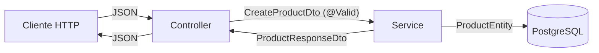
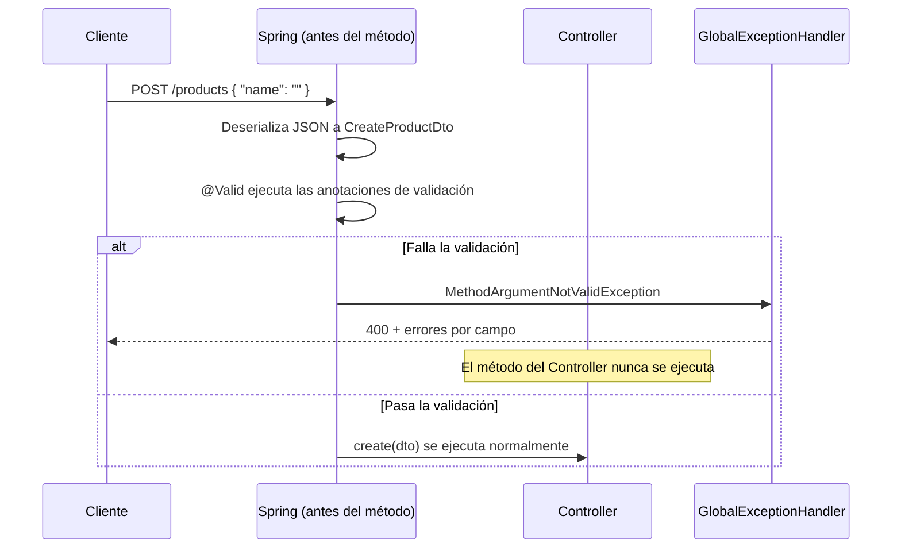

# Fase 4 — DTOs, mapeo y validación

> La evaluación pide un DTO "wrapper" (`ProductsResponseDto` con `size` + `data`) que no existe en tu proyecto — es el hueco más concreto que tienes que llenar aquí.

---

## 1. Por qué no se expone la Entity directamente



Si el Controller devolviera `ProductEntity` directamente:

- Se filtran campos internos (`isDeleted`, relaciones LAZY que rompen la serialización con `LazyInitializationException`).
- El cliente puede mandar campos que no debería (`id`, `owner`) y sobrescribir cosas sensibles.
- Cambiar la tabla obliga a cambiar el contrato de la API — Entity y contrato quedan acoplados.

El DTO es una **capa de traducción**: solo expone/acepta lo que el contrato de la API necesita.

---

## 2. DTO de entrada (Request) vs DTO de salida (Response)

Comparación real de tu proyecto — `CreateProductDto`, `ProductResponseDto` y `ProductEntity`:

| Campo | `ProductEntity` (BD) | `CreateProductDto` (entrada) | `ProductResponseDto` (salida) |
|---|---|---|---|
| `id` | ✅ (autogenerado) | ❌ (el cliente no lo manda) | ✅ (el cliente lo necesita) |
| `name` | ✅ | ✅ `@NotBlank @Size` | ✅ |
| `price` | ✅ | ✅ `@NotNull @DecimalMin` | ✅ |
| `stock` | ✅ | ✅ `@NotNull @Min` | ✅ |
| `owner` | `UserEntity` completo | ❌ (se saca del usuario autenticado, no del body) | `UserResponseDto` (versión pública del user) |
| `categoryIds` | — (se resuelve a `Set<CategoryEntity>`) | ✅ `@NotEmpty` (solo ids) | `Set<CategoryResponseDto>` (objetos completos) |
| `isDeleted` | ✅ | ❌ | ❌ (no le importa al cliente) |
| `createdAt` / `updatedAt` | ✅ | ❌ | ✅ |

**Patrón:** el DTO de entrada solo pide lo mínimo para crear el recurso (ids, no objetos); el DTO de salida devuelve datos ya resueltos y listos para mostrar (objetos anidados, no ids sueltos).

---

## 3. `@NotBlank`, `@Positive`, `@PositiveOrZero`, `@Min`, `@Size`

```java
public class CreateProductDto {

    @NotBlank(message = "El nombre es obligatorio")
    @Size(min = 3, max = 150, message = "El nombre debe tener entre 3 y 150 caracteres")
    private String name;

    @NotNull(message = "El precio es obligatorio")
    @DecimalMin(value = "0.0", inclusive = true, message = "El precio no puede ser negativo")
    private Double price;

    @NotNull(message = "El stock es obligatorio")
    @Min(value = 0, message = "El stock no puede ser negativo")
    private Integer stock;

    @NotEmpty(message = "Debe seleccionar al menos una categoría")
    private Set<Long> categoryIds;
}
```

| Anotación | Aplica a | Qué valida |
|---|---|---|
| `@NotBlank` | `String` | No nulo y no vacío/solo-espacios. |
| `@NotEmpty` | `Collection`/`String` | No nulo y con al menos un elemento. |
| `@NotNull` | Cualquiera | Solo que no sea `null` (permite `0`, `""`). |
| `@Size(min, max)` | `String`/`Collection` | Longitud o cantidad de elementos. |
| `@Min` / `@Max` | Numéricos enteros | Rango inclusive. |
| `@DecimalMin(inclusive = true)` | `Double`/`BigDecimal` | Igual que `@PositiveOrZero`, pero permite fijar el límite exacto. Tu proyecto usa esto en vez de `@Positive`/`@PositiveOrZero` para `price`. |
| `@Positive` / `@PositiveOrZero` | Numéricos | Atajos: `> 0` / `>= 0`. Equivalen a `@Min(1)` / `@Min(0)` para enteros. |

> Cada anotación lleva su `message` — ese texto es el que termina en el `details` del `ErrorResponse` cuando falla (ver Fase 5).

---

## 4. Cómo `@Valid` dispara un 400 automático

```java
@PostMapping
@ResponseStatus(HttpStatus.CREATED)
public ProductResponseDto create(@Valid @RequestBody CreateProductDto dto) { ... }
```



**Clave:** `@Valid` actúa **antes** de que el cuerpo del método corra. Si algo falla, Spring lanza `MethodArgumentNotValidException`, la captura `GlobalExceptionHandler` (Fase 5) y arma la respuesta 400 — el Service nunca se entera de que hubo un intento inválido.

Sin `@Valid`, las anotaciones (`@NotBlank`, etc.) están escritas pero **no se evalúan**.

---

## 5. El hueco: DTO wrapper con `size` + `data`

Tu proyecto ya pagina con `Page<ProductResponseDto>` (trae `content`, `totalElements`, etc. de Spring Data). Lo que **no existe** es un DTO propio y explícito con esa forma. La evaluación pide algo así:

```java
public class ProductsResponseDto {

    private int size;
    private List<ProductResponseDto> data;

    public ProductsResponseDto() {}

    public ProductsResponseDto(int size, List<ProductResponseDto> data) {
        this.size = size;
        this.data = data;
    }

    // getters y setters
}
```

Uso típico en un Controller:

```java
@GetMapping
public ProductsResponseDto findAll() {
    List<ProductResponseDto> products = productService.findAll();
    return new ProductsResponseDto(products.size(), products);
}
```

Diferencia con lo que ya tienes: `Page`/`Slice` son objetos de Spring Data (con metadatos de paginación reales: `totalPages`, `first`, `last`...). Un DTO wrapper como este es **tuyo**, más simple, y solo envuelve un tamaño + una lista — típico de exámenes que piden una forma de respuesta específica sin depender de las clases de Spring Data.

---

## Resumen / Chuleta

| Pregunta | Respuesta corta |
|---|---|
| ¿Por qué no devolver la Entity? | Expone campos internos, rompe con relaciones LAZY, acopla el contrato de la API a la tabla. |
| ¿Diferencia DTO entrada vs salida? | Entrada pide lo mínimo (ids); salida devuelve todo resuelto (objetos anidados). |
| ¿Qué dispara `@Valid`? | Corre las anotaciones de validación antes del método; si falla, nunca llega al Controller/Service. |
| ¿Qué le falta al proyecto? | Un DTO wrapper propio tipo `{ size, data }`, distinto de `Page`/`Slice`. |

---

## Cómo estudiarlo

> Compara `CreateProductDto`, `ProductResponseDto` y `ProductEntity` de tu proyecto: anota qué campos tiene cada uno y por qué. Luego arma tú misma un DTO wrapper nuevo con `size` + `data`, que no existe en tu código actual.

**Práctica sugerida:** Práctica 3, Práctica 6

---

## Checklist

- [ ] Sé explicar por qué no se expone la Entity directamente
- [ ] Sé usar `@NotBlank`, `@Positive`, `@Min` y `@Size` correctamente
- [ ] Entiendo cómo `@Valid` dispara un 400 automático
- [ ] Armé un DTO wrapper (`size` + `data`) desde cero
