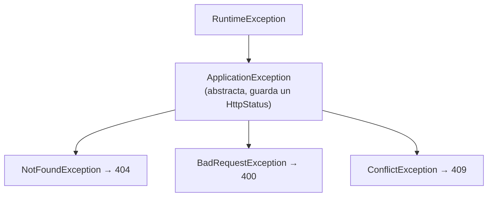
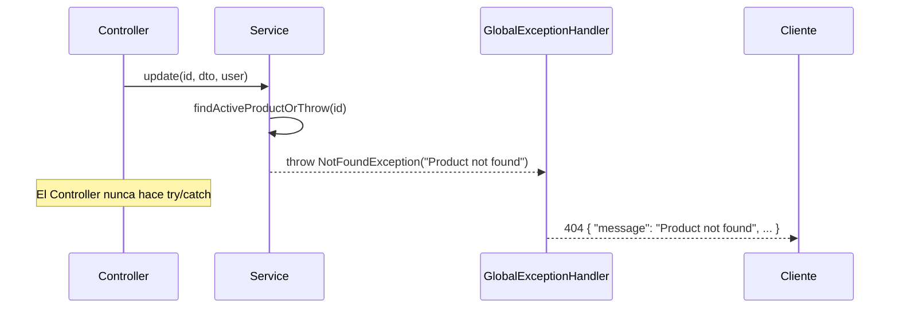

# Fase 5 — Manejo de errores

> Ya lo hiciste en la Práctica 7 — esta fase es sobre todo repaso activo, no contenido nuevo.

---

## 1. Excepciones custom extendiendo `RuntimeException`



```java
public class ApplicationException extends RuntimeException {
    private final HttpStatus status;

    protected ApplicationException(HttpStatus status, String message) {
        super(message);
        this.status = status;
    }

    public HttpStatus getStatus() { return status; }
}
```

```java
public class NotFoundException extends ApplicationException {
    public NotFoundException(String message) {
        super(HttpStatus.NOT_FOUND, message); // 404
    }
}
```

`ApplicationException` es la base: cada subclase solo fija **qué status HTTP** le corresponde. El resto del código lanza `throw new NotFoundException("Product not found")` sin pensar en HTTP — el status ya viaja pegado a la excepción.

Se extiende `RuntimeException` (no `Exception` a secas) para que sea **unchecked**: no obliga a poner `throws` ni `try/catch` en cada Service.

Uso real en `ProductServiceImpl`:

```java
private ProductEntity findActiveProductOrThrow(Long id) {
    return repository.findById(id)
            .filter(product -> !product.isDeleted())
            .orElseThrow(() -> new NotFoundException("Product not found"));
}
```

---

## 2. `@RestControllerAdvice` + `@ExceptionHandler`

```java
@RestControllerAdvice
public class GlobalExceptionHandler {

    @ExceptionHandler(ApplicationException.class)
    public ResponseEntity<ErrorResponse> handleApplicationException(
            ApplicationException ex, HttpServletRequest request) {
        ErrorResponse response = new ErrorResponse(ex.getStatus(), ex.getMessage(), request.getRequestURI());
        return ResponseEntity.status(ex.getStatus()).body(response);
    }
}
```

`@RestControllerAdvice` = interceptor global para **todos** los Controllers. Cada `@ExceptionHandler(TipoDeExcepcion.class)` es un `catch` centralizado: en vez de poner `try/catch` en cada endpoint, una excepción lanzada en cualquier Service sube hasta aquí y se convierte en una respuesta HTTP consistente.



Manejadores que ya tienes en `GlobalExceptionHandler`:

| `@ExceptionHandler(...)` | Cuándo se dispara | Status |
|---|---|---|
| `ApplicationException` | Cualquier `NotFoundException`/`BadRequestException`/`ConflictException` propia | El que trae la excepción (404/400/409) |
| `MethodArgumentNotValidException` | Falla `@Valid @RequestBody` | 400 + `details` por campo |
| `BindException` | Falla validación en `@ModelAttribute` (query params, ej. `PaginationDto`) | 400 + `details` por campo |
| `AuthorizationDeniedException` | `@PreAuthorize` evalúa `false` (rol insuficiente) | 403 |
| `AccessDeniedException` | Lanzada a mano en el Service (ej. `validateOwnership`) | 403 |
| `AuthenticationException` | Token inválido/expirado | 401 |
| `Exception` (genérico, **al final**) | Cualquier cosa no capturada arriba | 500 |

> El orden de `@ExceptionHandler` no importa para Spring (matchea por tipo más específico), pero **conceptualmente** el genérico `Exception.class` es la red de seguridad final — si le llega algo, es porque nadie más lo esperaba.

---

## 3. Cómo devolver un 404 y un 400 con detalle de campos

`ErrorResponse` es la forma única de cuerpo de error de toda la API:

```java
public class ErrorResponse {
    private LocalDateTime timestamp;
    private int status;
    private String error;      // "Not Found", "Bad Request"...
    private String message;
    private String path;
    private Map<String, String> details;  // solo en errores de validación
}
```

**404 simple** (`NotFoundException`):

```json
{
  "timestamp": "2026-07-19T10:00:00",
  "status": 404,
  "error": "Not Found",
  "message": "Product not found",
  "path": "/api/products/999"
}
```

**400 con detalle por campo** (`MethodArgumentNotValidException`, viene de `@Valid`):

```java
@ExceptionHandler(MethodArgumentNotValidException.class)
public ResponseEntity<ErrorResponse> handleValidationException(
        MethodArgumentNotValidException ex, HttpServletRequest request) {
    Map<String, String> errors = new HashMap<>();
    ex.getBindingResult().getFieldErrors()
            .forEach(error -> errors.put(error.getField(), error.getDefaultMessage()));

    ErrorResponse response = new ErrorResponse(HttpStatus.BAD_REQUEST, "Datos de entrada inválidos",
            request.getRequestURI(), errors);
    return ResponseEntity.badRequest().body(response);
}
```

```json
{
  "status": 400,
  "error": "Bad Request",
  "message": "Datos de entrada inválidos",
  "path": "/api/products",
  "details": {
    "name": "El nombre es obligatorio",
    "price": "El precio no puede ser negativo"
  }
}
```

`details` viaja como `null` cuando no aplica — `@JsonInclude(JsonInclude.Include.NON_NULL)` en `ErrorResponse` lo omite del JSON en vez de mandar `"details": null`.

---

## Resumen / Chuleta

| Pregunta | Respuesta corta |
|---|---|
| ¿Por qué extender `RuntimeException` y no `Exception`? | Para que sea *unchecked*: no obliga `throws`/`try-catch` en cada Service. |
| ¿Qué hace `@RestControllerAdvice`? | Centraliza el manejo de excepciones de todos los Controllers en una sola clase. |
| ¿Cómo sabe cada excepción qué status devolver? | `ApplicationException` guarda un `HttpStatus`; cada subclase lo fija en su constructor. |
| ¿Cuándo aparece `details` en el `ErrorResponse`? | Solo en errores de validación (`MethodArgumentNotValidException`/`BindException`); el resto lo omite. |

---

## Cómo estudiarlo

> Lee `GlobalExceptionHandler.java` línea por línea. Por cada `@ExceptionHandler`, pregúntate: "¿qué situación real del usuario dispara esto?". Luego provócalos a propósito desde Postman.

**Práctica sugerida:** Práctica 7

---

## Checklist

- [ ] Sé crear una excepción custom extendiendo `RuntimeException`
- [ ] Entiendo qué hace `@RestControllerAdvice`
- [ ] Provoqué cada error de mi `GlobalExceptionHandler` desde Postman
