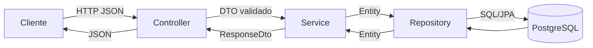
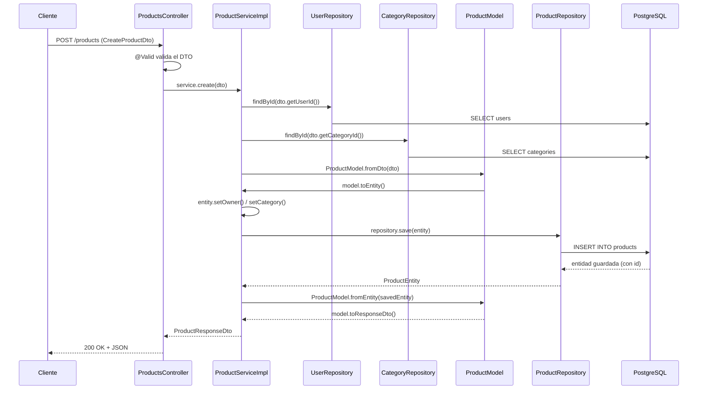

# Flujo de datos del proyecto

Guía práctica de cómo viaja una petición HTTP a través de este proyecto Spring Boot, capa por capa, con clases y métodos reales.

## 1. Arquitectura en capas



| Capa | Paquete | Responsabilidad |
|---|---|---|
| **Controller** | `*.controllers` | Recibe la petición HTTP, valida el DTO de entrada (`@Valid`) y delega al Service. No tiene lógica de negocio. |
| **DTO** | `*.dtos` | Transporta datos entre el cliente y la API. Trae las anotaciones de validación (`@NotBlank`, `@Size`, etc.). |
| **Service** | `*.services` | Contiene la lógica de negocio: valida reglas, orquesta conversiones, decide cuándo lanzar excepciones. |
| **Model** (solo Products/Users) | `*.models` | Representación interna del dominio, sin anotaciones JPA. Sabe convertirse desde/hacia DTO y Entity. |
| **Mapper** (solo Users) | `*.mappers` | Clase estática que hace las conversiones DTO ↔ Model ↔ Entity, en vez de tenerlas dentro del Model. |
| **Repository** | `*.repositories` | Interfaz `JpaRepository`. Ejecuta las queries contra PostgreSQL. |
| **Entity** | `*.entities` | Representa una tabla real (`@Entity`). Es lo único que Hibernate persiste. |
| **Exception Handler** | `core.exceptions` | Convierte excepciones lanzadas en el Service en respuestas HTTP con el `status` correcto. |

> Dato clave: **cada módulo (`products`, `users`, `categories`) implementa esta arquitectura de forma ligeramente distinta.** Ver la [comparación de módulos](#5-comparación-entre-módulos) más abajo.

---

## 2. Flujo paso a paso (caso genérico)

```
Cliente
   ↓
Controller      → recibe HTTP, valida DTO con @Valid
   ↓
DTO de entrada  → CreateXDto / UpdateXDto
   ↓
Service         → lógica de negocio, valida reglas
   ↓
Repository      → consulta/guarda en PostgreSQL
   ↓
Entity          → fila real de la tabla
   ↓
Model/Mapper    → convierte Entity → dominio → DTO
   ↓
DTO de salida   → XResponseDto (sin campos sensibles)
   ↓
Response        → JSON al cliente
```

### Ejemplo real: `POST /products`



1. **Controller** ([ProductsController.java](../src/main/java/ec/edu/ups/icc/fundamentos01/products/controllers/ProductsController.java)): `create(@Valid @RequestBody CreateProductDto dto)` — Spring valida el DTO automáticamente antes de entrar al método. Si falla, ni siquiera llega al Service (ver [manejo de errores](#4-manejo-de-errores)).
2. **Service** (`ProductServiceImpl.create`): busca el `UserEntity` y el `CategoryEntity` referenciados por id; si no existen, lanza `NotFoundException`.
3. **Model** (`ProductModel.fromDto` → `toEntity`): convierte el DTO recibido en una entidad lista para persistir.
4. **Repository** (`ProductRepository.save`): Spring Data JPA genera el `INSERT` y devuelve la entidad con el `id` generado.
5. **Vuelta atrás**: `ProductModel.fromEntity(savedEntity).toResponseDto()` arma el DTO de salida, que **no expone** campos internos como `deleted`.

---

## 3. Cada capa en detalle

### Controller

- Solo tiene `@GetMapping`, `@PostMapping`, etc. y delega todo al `Service` inyectado por constructor.
- `@Valid` en el parámetro dispara las validaciones del DTO (`@NotBlank`, `@Size`, `@Email`...) **antes** de ejecutar el cuerpo del método.
- Ejemplo — [ProductsController.java](../src/main/java/ec/edu/ups/icc/fundamentos01/products/controllers/ProductsController.java):

```java
@GetMapping("/category/{id}")
public List<ProductResponseDto> findByCategory(@PathVariable Long id) {
    return service.findByCategory(id);
}
```

### DTO (Data Transfer Object)

> **Concepto:** objeto plano que solo transporta datos entre capas/cliente, sin lógica. Existe uno distinto por operación para no exponer ni aceptar más campos de los necesarios.

| DTO | Uso |
|---|---|
| `CreateXDto` | Entrada de `POST`. Trae validaciones obligatorias. |
| `UpdateXDto` | Entrada de `PUT`. Reemplaza todos los campos editables. |
| `PartialUpdateXDto` | Entrada de `PATCH`. Todos los campos son opcionales (pueden venir `null`). |
| `XResponseDto` | Salida. Nunca incluye campos sensibles (`password`, `passwordHash`) ni internos (`deleted`). |

### Service

- Es donde vive la **lógica de negocio real**: validar duplicados, validar existencia de relaciones, aplicar soft delete, etc.
- Siempre lanza excepciones de `core.exceptions.domain` (`NotFoundException`, `ConflictException`) en vez de devolver `null` o booleanos de error.
- Ejemplo de regla de negocio — `CategoryServiceImpl.create`:

```java
if (categoryRepository.existsByNameIgnoreCaseAndIsDeletedFalse(dto.getName())) {
    throw new ConflictException("Category name already registered");
}
```

### Repository

> **Concepto:** interfaz que extiende `JpaRepository<Entity, IdType>`. Spring Data JPA implementa los métodos en tiempo de ejecución — no hay que escribir SQL.

- Los métodos CRUD básicos (`save`, `findById`, `findAll`, `deleteById`) vienen gratis por herencia.
- Los métodos personalizados se generan **a partir del nombre del método** (query derivation). Ejemplos reales:

```java
// ProductRepository
List<ProductEntity> findByCategoryIdAndIsDeletedFalse(Long categoryId);

// CategoryRepository
boolean existsByNameIgnoreCaseAndIsDeletedFalse(String name);

// UserRepository
Optional<UserEntity> findByIdAndDeletedFalse(Long id);
```

Spring traduce `findByCategoryIdAndIsDeletedFalse` como: navega `product.category.id`, filtra por `isDeleted = false`. No hay que implementarlo a mano.

### Entity

> **Concepto:** clase anotada con `@Entity` que representa una fila de una tabla. Es la única capa que Hibernate conoce y persiste.

- Todas heredan de [`BaseEntity`](../src/main/java/ec/edu/ups/icc/fundamentos01/core/entities/BaseEntity.java), que centraliza:
  - `id` (autogenerado, `IDENTITY`)
  - `createdAt` / `updatedAt` (asignados automáticamente con `@PrePersist` / `@PreUpdate`)
  - `isDeleted` (soft delete: nunca se borra una fila físicamente, solo se marca)
- `ProductEntity` tiene relaciones `@ManyToOne` hacia `UserEntity` y `CategoryEntity` (un producto pertenece a un usuario y a una categoría).

### Model (solo `products` y `users`)

> **Concepto:** representación del dominio **sin** anotaciones JPA. Existe para que la lógica de negocio no dependa directamente de la entidad de base de datos.

- `ProductModel` es un caso particular: **el propio modelo sabe convertirse**, no depende de una clase Mapper aparte:

```java
ProductModel.fromDto(dto)      // DTO      -> Model
ProductModel.fromEntity(e)     // Entity   -> Model
model.toEntity()               // Model    -> Entity
model.toResponseDto()          // Model    -> DTO de salida
model.update(dto)              // aplica cambios de un UpdateDto (PUT)
model.partialUpdate(dto)       // aplica solo los campos no nulos (PATCH)
```

- Nota: existe `ProductMapper.java`, pero **todo su contenido está comentado** — es código muerto, no se usa. La conversión real ocurre en `ProductModel`.

### Mapper (solo `users`)

> **Concepto:** clase con métodos estáticos dedicados a convertir entre capas, separando esa responsabilidad del propio Model.

`UserMapper` centraliza las 4 conversiones que en `products` viven dentro del Model:

```java
UserMapper.toModelFromDTO(dto)      // CreateUserDto -> UserModel
UserMapper.toModelFromEntity(e)     // UserEntity    -> UserModel
UserMapper.toEntityFromModel(model) // UserModel     -> UserEntity
UserMapper.toResponse(model)        // UserModel     -> UserResponseDto (sin password)
```

### Categories: sin Model ni Mapper

`categories` es el módulo más simple: el `Service` convierte `CategoryEntity → CategoryResponseDto` directamente con un método privado `toResponse()`, sin pasar por ningún Model intermedio.

---

## 4. Manejo de errores

> **Concepto — `@RestControllerAdvice`:** clase global que intercepta excepciones lanzadas por cualquier Controller/Service y las transforma en una respuesta HTTP consistente, sin que cada Controller tenga que hacer `try/catch`.

```mermaid
flowchart TD
    A[Service lanza excepción] --> B{Tipo}
    B -->|ApplicationException<br>NotFound / Conflict / BadRequest| C[GlobalExceptionHandler<br>handleApplicationException]
    B -->|MethodArgumentNotValidException<br>@Valid falló| D[GlobalExceptionHandler<br>handleValidationException]
    B -->|Cualquier otra| E[GlobalExceptionHandler<br>handleUnexpectedException]
    C --> F["ErrorResponse { status, error, message, path }"]
    D --> G["ErrorResponse { ...detalles por campo }"]
    E --> H["500 Internal Server Error"]
```

- **`ApplicationException`** ([base](../src/main/java/ec/edu/ups/icc/fundamentos01/core/exceptions/base/ApplicationException.java)): clase abstracta con un `HttpStatus` fijo.

| Excepción | HTTP Status | Cuándo se usa |
|---|---|---|
| `NotFoundException` | 404 | El recurso (usuario, producto, categoría) no existe o está soft-deleted. |
| `ConflictException` | 409 | Se viola una regla de unicidad (email duplicado, nombre de categoría duplicado). |
| `BadRequestException` | 400 | Definida pero sin uso actual en el código. |

- **[`GlobalExceptionHandler`](../src/main/java/ec/edu/ups/icc/fundamentos01/core/exceptions/handler/GlobalExceptionHandler.java)** tiene 3 métodos:
  1. `handleApplicationException` → captura cualquier `ApplicationException` y arma el `ErrorResponse` con el status correcto.
  2. `handleValidationException` → captura fallos de `@Valid`, junta todos los errores de campo en un `Map<String, String>`.
  3. `handleUnexpectedException` → red de seguridad para excepciones no controladas (500), evita filtrar stack traces.

Ejemplo de body de error real (404):
```json
{
  "timestamp": "2026-07-01T10:00:00",
  "status": 404,
  "error": "Not Found",
  "message": "Product not found",
  "path": "/products/999"
}
```

---

## 5. Comparación entre módulos

| | **Products** | **Users** | **Categories** |
|---|---|---|---|
| Controller lanza try/catch propio | No | Sí (`IllegalStateException`, pero **nunca se dispara** porque el Service lanza `ApplicationException`, que va directo al `GlobalExceptionHandler`) | No |
| ¿Tiene capa Model? | Sí (`ProductModel`, con conversión propia) | Sí (`UserModel`) | No |
| ¿Tiene capa Mapper? | No (código muerto en `ProductMapper`) | Sí (`UserMapper`, estático) | No |
| Conversión Entity → DTO | `ProductModel.fromEntity().toResponseDto()` | `UserMapper.toModelFromEntity()` + `toResponse()` | `toResponse()` privado dentro del Service |
| Soft delete | `isDeleted` (heredado de `BaseEntity`) | `isDeleted` (heredado de `BaseEntity`) | `isDeleted` (heredado, pero `delete()` **no lo activa** — bug/pendiente, línea comentada) |

---

## 6. Caso especial: Users

El flujo de `users` es el más "sobre-construido" del proyecto por dos razones:

### 6.1 Usa `UserMapper` en vez de conversión propia del Model
A diferencia de `ProductModel` (que sabe convertirse a sí mismo), `UserModel` es un objeto de datos puro y toda la conversión vive en una clase aparte, `UserMapper`, con 4 métodos estáticos (`toModelFromDTO`, `toModelFromEntity`, `toEntityFromModel`, `toResponse`). Es el único módulo que separa esa responsabilidad.

### 6.2 Maneja la contraseña con un campo extra
`UserModel` tiene **dos** campos relacionados a la clave: `password` (texto plano recibido del DTO) y `passwordHash` (lo que realmente se persiste). La "encriptación" es simulada:

```java
model.setPasswordHash("HASH_" + dto.getPassword());
```
Esto ocurre en `UserMapper.toModelFromDTO` (al crear) y directamente en `UserServiceImpl.partialUpdate` (al actualizar por PATCH). `UserResponseDto` **nunca** incluye `password` ni `passwordHash`.

### 6.3 `UsersController` tiene try/catch redundante
Cada método (`findOne`, `create`, `update`, `partialUpdate`, `delete`) envuelve la llamada al Service en:
```java
try {
    return service.findOne(id);
} catch (IllegalStateException e) {
    return ResponseEntity.status(HttpStatus.BAD_REQUEST)...
}
```
Pero `UserServiceImpl` **nunca lanza `IllegalStateException`** — lanza `NotFoundException` / `ConflictException`, que extienden `ApplicationException` y son interceptadas por `GlobalExceptionHandler` **antes** de llegar a este `catch`. Es decir: **este bloque try/catch es código muerto**, probablemente un resabio de una versión anterior a la introducción del manejo global de excepciones. Los otros dos controllers (`ProductsController`, `CategoriesController`) no lo tienen.

### 6.4 Reglas de negocio propias de Users
- Email único al crear (`ConflictException` si `findByEmail` ya existe).
- Email único al actualizar, **solo si cambió** (compara `entity.getEmail()` contra el nuevo antes de validar duplicado).
- `partialUpdate` valida longitud mínima de password (8 caracteres) manualmente en el Service, además de la validación del DTO.
- `delete` es soft delete real (sí marca `isDeleted = true`, a diferencia de `categories.delete()`).

---

## 7. Resumen / Chuleta de estudio

| Componente | Qué hace |
|---|---|
| **Controller** | Recibe la petición HTTP, valida el DTO (`@Valid`), delega al Service. No tiene lógica de negocio. |
| **DTO** | Transporta datos (entrada/salida). Trae las validaciones (`@NotBlank`, `@Size`...). |
| **Service** | Contiene la lógica de negocio: valida reglas, decide cuándo lanzar excepciones, orquesta Repository + Model/Mapper. |
| **Model** | Representación interna del dominio, sin JPA. Puede convertirse solo (`products`) o depender de un Mapper (`users`). |
| **Mapper** | Convierte entre DTO ↔ Model ↔ Entity con métodos estáticos. Solo existe en `users`. |
| **Repository** | Interfaz `JpaRepository`. Ejecuta queries; los métodos personalizados se generan por nombre. |
| **Entity** | Representa una tabla real (`@Entity`). Hereda `id`, `createdAt`, `updatedAt`, `isDeleted` de `BaseEntity`. |
| **Exception Handler** | `@RestControllerAdvice` que transforma excepciones (`NotFoundException`, `ConflictException`, fallos de `@Valid`) en respuestas HTTP consistentes. |

**Regla mental rápida:**
```
Petición → Controller valida forma (DTO) → Service valida negocio → Repository toca la BD → 
Entity ↔ Model/Mapper convierten → DTO de salida → Respuesta
```
Si algo falla en el Service, se lanza una excepción de `core.exceptions.domain` y el `GlobalExceptionHandler` la convierte en JSON con el status HTTP correcto — el Controller no necesita saber nada de eso.
