# EVIDENCIA DEMOSTRATIVA

## 1 crear un producto nombre laptop
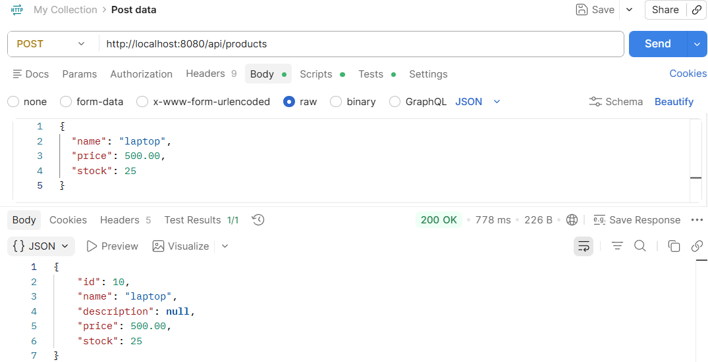

## 2 crear un producto nombre smartphone
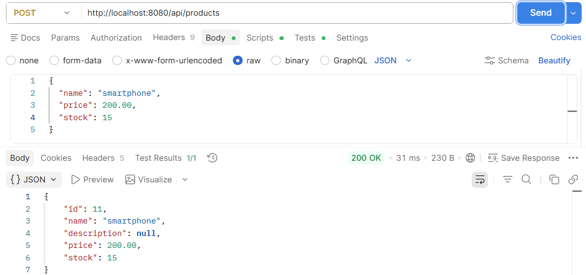

## 3 cambiar nombre del producto laptop a "notebook"
El id del producto creado laptop es 10. Por eso se usa esa ruta para hacer el PUT
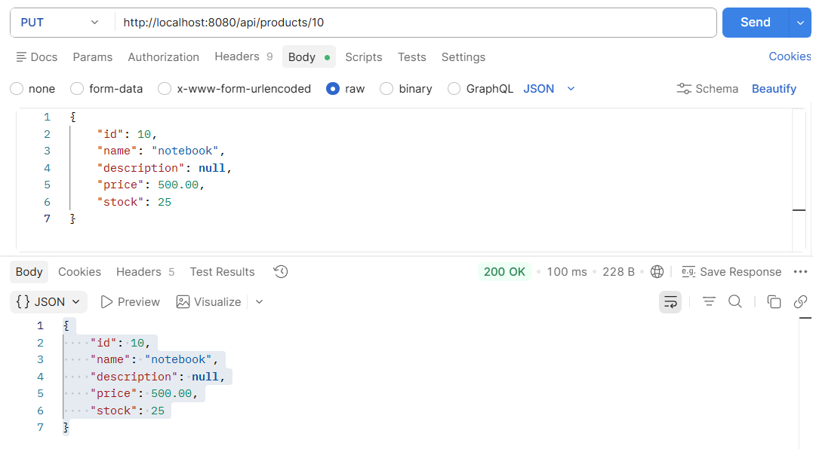

## 4 eliminar el producto smartphone
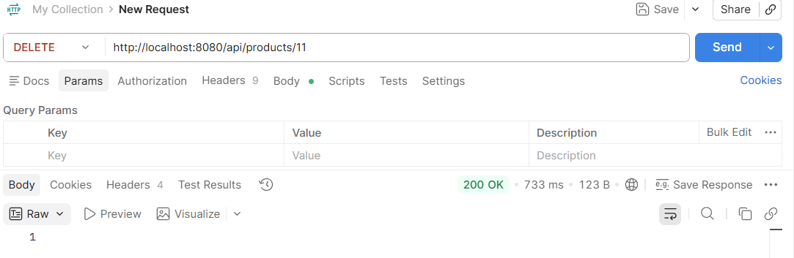

5 en DB select a productos, debere ver los
2 productos
- notebook con fecha de modificación actual
- smartphone eliminado logico en true
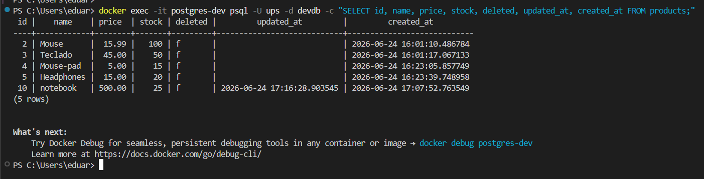

---

# Práctica 1: Spring Boot - Instalación, Configuración e Implementación del Primer Endpoint

**Asignatura:** Programación y Plataformas Web  
**Estudiante:** Verónica Cobos     

---
## 1. Captura de Verificación de Java

Salida del comando `java -version` verificando que Java 21 está instalado correctamente.

**Comando ejecutado:**
```bash
java -version
```

**Evidencia:**


---

## 2. Captura del Servidor Spring Boot Ejecutándose

Terminal mostrando que el servidor Tomcat se inició correctamente en el puerto 8080.

**Comando ejecutado:**
```bash
gradlew bootRun
```

**Evidencia:**
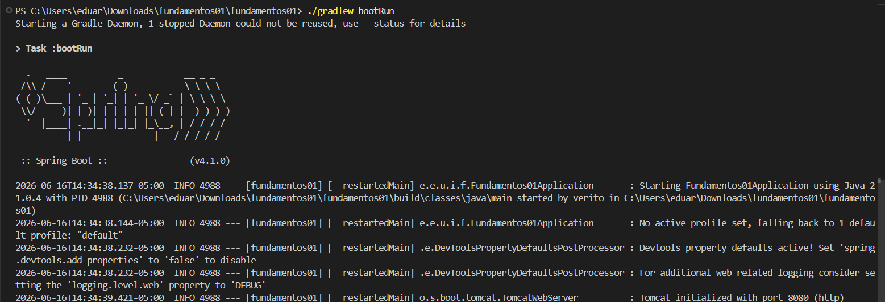

---

## 3. Captura del Endpoint `/api/status` Funcionando

Navegador mostrando la respuesta JSON del endpoint REST implementado.

**URL accedida:**
```
http://localhost:8080/api/status
```

**Evidencia:**  
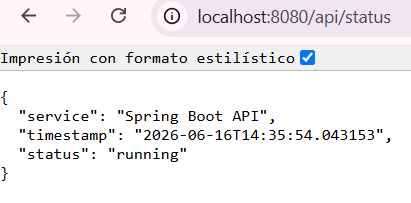

---

## 4. Captura del Archivo StatusController.java Creado

Terminal mostrando que el archivo `StatusController.java` existe en la carpeta correcta.

**Comando ejecutado:**
```bash
ls ./src/main/java/ec/edu/ups/icc/fundamentos01/controllers/
```

**Evidencia:**
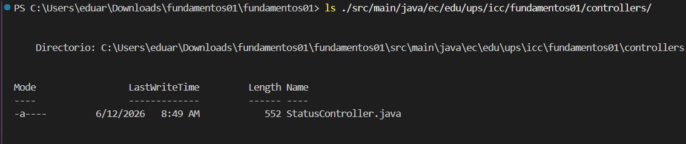

---

## 5. Explicación del Estudiante

### 5.1 ¿Qué entendiste sobre el funcionamiento del endpoint?

El endpoint `/api/status` es una URL que responde a peticiones HTTP de tipo GET. Cuando accedo a `http://localhost:8080/api/status` desde mi navegador, el servidor Spring Boot procesa la solicitud y devuelve una respuesta en formato JSON. Esta respuesta contiene:

- `service`: El nombre del servicio ("Spring Boot API")
- `status`: El estado actual del servidor ("running")
- `timestamp`: La fecha y hora exacta en que se realizó la consulta

La anotación `@GetMapping("/api/status")` en el controlador especifica que este método solo responde a peticiones GET en esa ruta específica.

---

### 5.2 ¿Cuál es la función general de Spring Boot en la creación del servidor?

Spring Boot simplifica enormemente la creación de servidores web en Java. Sus principales funciones son:

1. **Servidor embebido:** Spring Boot incluye automáticamente un servidor Tomcat dentro de la aplicación. No necesito instalar Tomcat por separado ni configurarlo manualmente. Cuando ejecuto `gradlew bootRun`, Tomcat se inicia automáticamente en el puerto 8080.

2. **Auto-configuración:** Spring Boot detecta automáticamente las dependencias que agregué (Spring Web, Spring Boot DevTools) y configura todo lo necesario sin que tenga que escribir código de configuración complejo en XML.

3. **Ejecución rápida:** Puedo iniciar la aplicación con un simple comando y tener un servidor HTTP funcional en segundos, listo para recibir peticiones.

4. **Desarrollo ágil:** Spring Boot DevTools permite que los cambios en el código se reflejen automáticamente sin reiniciar el servidor, acelerando el desarrollo.

Sin Spring Boot, tendría que: instalar Tomcat, configurarlo manualmente, desplegar archivos `.war`, reiniciar servicios, etc. Spring Boot elimina toda esa complejidad.

---
# Práctica 2 (Spring Boot): Estructura del Proyecto, Arquitectura Interna y Organización Modular
---

## 1. Estructura modular en el IDE

En el IDE visual se ven las carpetas separadas (`config`, `utils`, `products`, `users`, `auth`) y dentro de `products` sus capas (`controllers`, `services`, etc.).

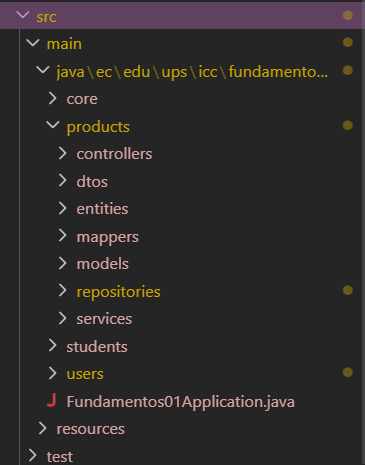

---

## 2. Archivo Fundamentos01Application.java

Se debe verificar:

- el package raíz
- la ubicación correcta que permite ComponentScan

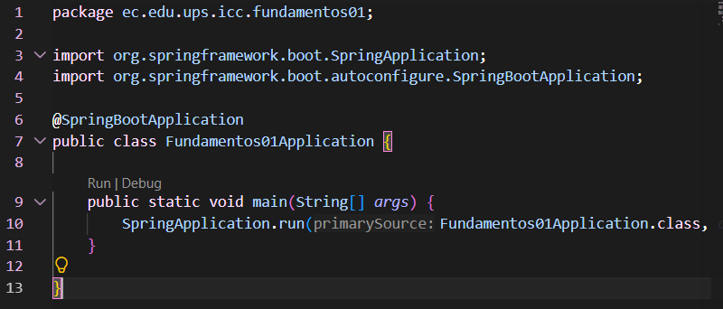

---
## 3. Explicación breve
### Por qué es importante tener módulos separados?


Tener los módulos separados es importante porque mantiene el proyecto ordenado y fácil de manejar cuando crece. Cada dominio (`products`, `users`, `auth`) tiene sus propias capas (controllers, services, repositories, etc.), así que todo lo de un mismo tema está junto y es más rápido de encontrar y mantener. Además, como cada módulo es bastante independiente, se puede trabajar en uno sin romper los demás, y el proyecto se parece más a una aplicación real en vez de tener todo amontonado en un solo lugar.

---
# Práctica 3 (Spring Boot): Construcción de una API REST usando controladores, DTOs, modelos y mappers

## 1. Consumo de los endpoints de Products desde Postman

### GET /api/products (con 3 productos creados)

Pedí la lista de productos y se ven los 3 que ya tengo creados.

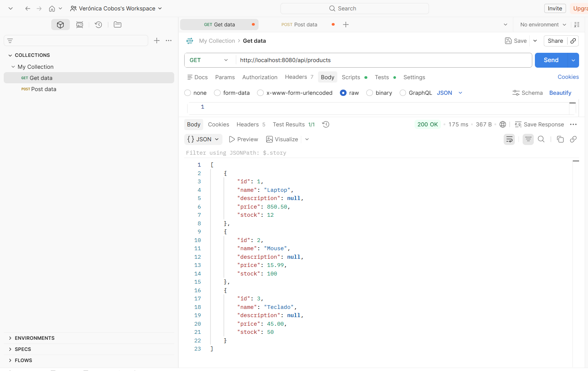

---

### GET /api/products/:id (producto existente)

Pedí un producto por su ID y me devuelve sus datos.

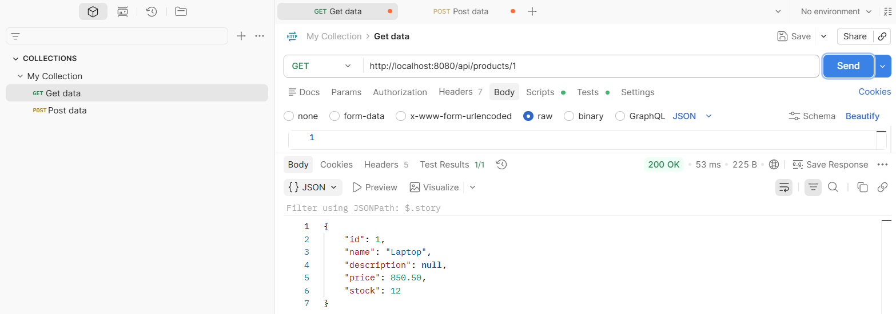

---

### DELETE /api/products/:id (producto existente)

Borré un producto que sí existe y me confirma que se eliminó.

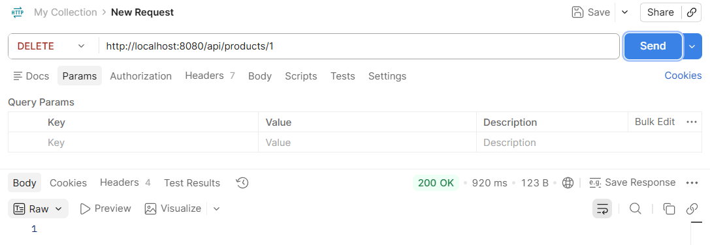

---

### DELETE /api/products/:id (producto que no existe)

Intenté borrar un producto con un ID que no existe y me devuelve el mensaje de error.

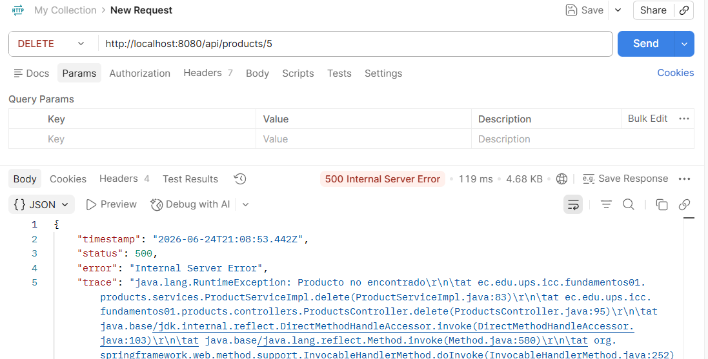

---
# Práctica 4 (Spring Boot): Controladores + Servicios + Lógica de Negocio

## 1. ProductServiceImpl.java completa

Aquí está la implementación del servicio con toda la lógica del CRUD. Se ve la anotación `@Service`, la lista en memoria, el generador de ID, el uso del mapper para convertir productos y los métodos.

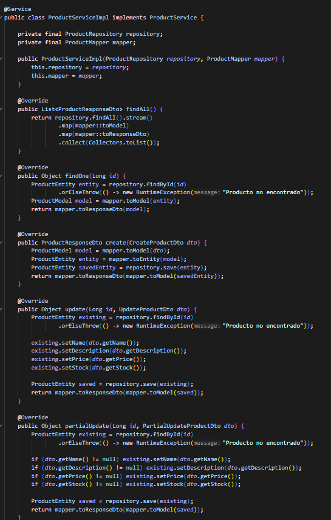

---

## 2. ProductsController.java

Aquí se ve el controlador que solo recibe peticiones y delega al servicio. Lo importante es que ya no tiene la lógica del CRUD, solo tiene la inyección del `ProductService` por constructor y cada endpoint simplemente llama al método correspondiente del servicio.

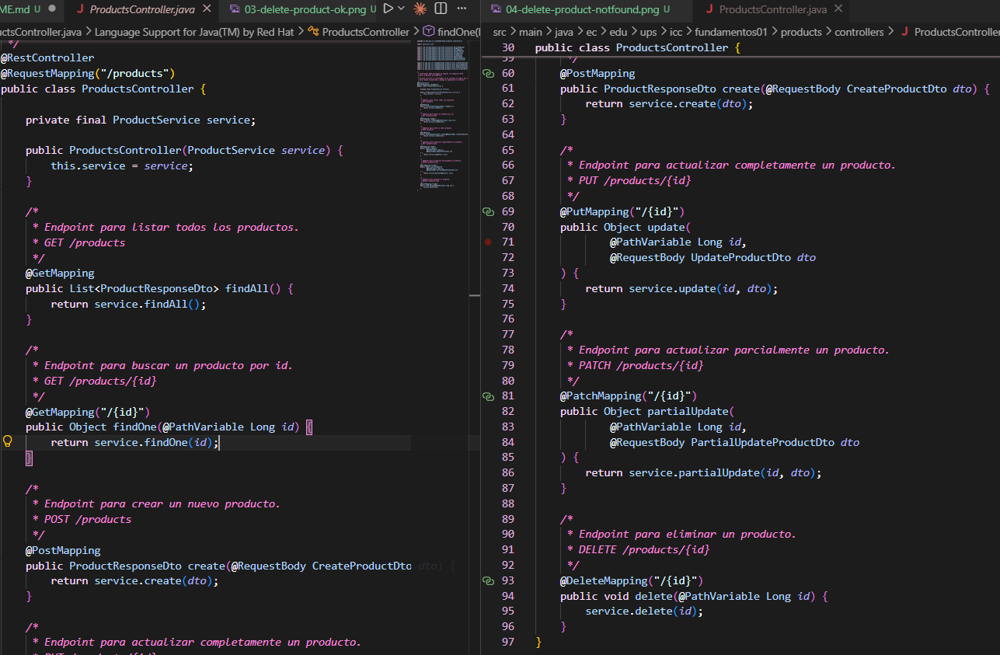

---

## 3. Explicación breve
### ¿Cómo se inyecta el servicio en el controlador?
El servicio se inyecta en el controlador a través del constructor. Cuando Spring Boot ve que el controlador pide un `ProductService`, busca en todo el proyecto una clase que implemente esa interfaz. Encuentra `ProductServiceImpl` que tiene `@Service`, así que Spring automáticamente crea una instancia y la pasa al constructor del controlador. El controlador la guarda en una variable privada final y la usa. Así el controlador no tiene que crear el servicio manualmente, solo lo recibe listo para usar. Esto es la inyección de dependencias.

---
# Práctica 5 (Spring Boot): Persistencia real con PostgreSQL, Entidades JPA y Repositorios
## 1. Captura de 5 productos creados en PostgreSQL

Hice la consulta `SELECT * FROM products;` y aparecen los 5 productos que creé mediante la API REST. Se ven los campos id, name, price, stock, createdAt, updatedAt y deleted que vienen de BaseEntity.

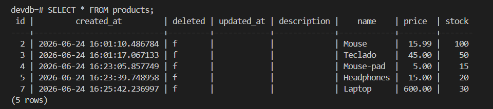

---

## 2. Explicación breve
### Explicar brevemente el flujo de datos desde la API REST hasta PostgreSQL y viceversa, destacando el uso de BaseEntity.

El flujo de datos funciona así: cuando se crea un producto desde la API (POST), el controlador recibe un CreateProductDto y lo pasa al servicio. El servicio convierte el DTO a ProductModel, luego a ProductEntity. Esa entidad se guarda en PostgreSQL mediante el repositorio. Cuando se consulta (GET), el repositorio trae la ProductEntity de la base de datos, se convierte a ProductModel, y luego a ProductResponseDto para devolver al cliente.

Lo importante de BaseEntity es que centraliza los campos comunes (id, createdAt, updatedAt, deleted) en una sola clase. Todas las entidades heredan de BaseEntity, así que no tengo que repetir esos campos en cada una. El `@PrePersist` asigna automáticamente la fecha de creación cuando se guarda por primera vez, y `@PreUpdate` actualiza la fecha de modificación cada vez que se edita. Esto permite rastrear cuándo se creó y cuándo se modificó cada registro.

---
# Práctica 6 (Spring Boot): Validación de DTOs y Control de Datos de Entrada

## 1. Error al crear producto con precio negativo
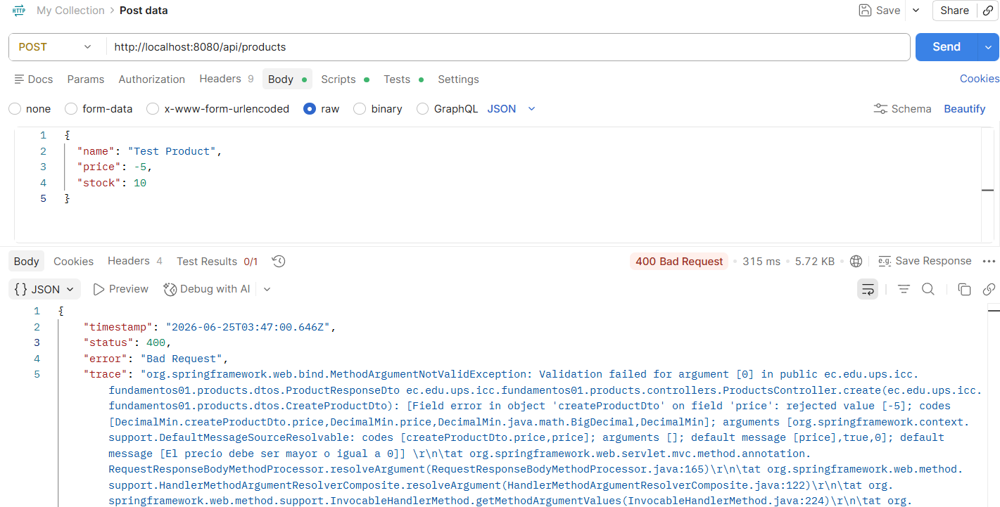

## 2. Error al actualizar producto eliminado
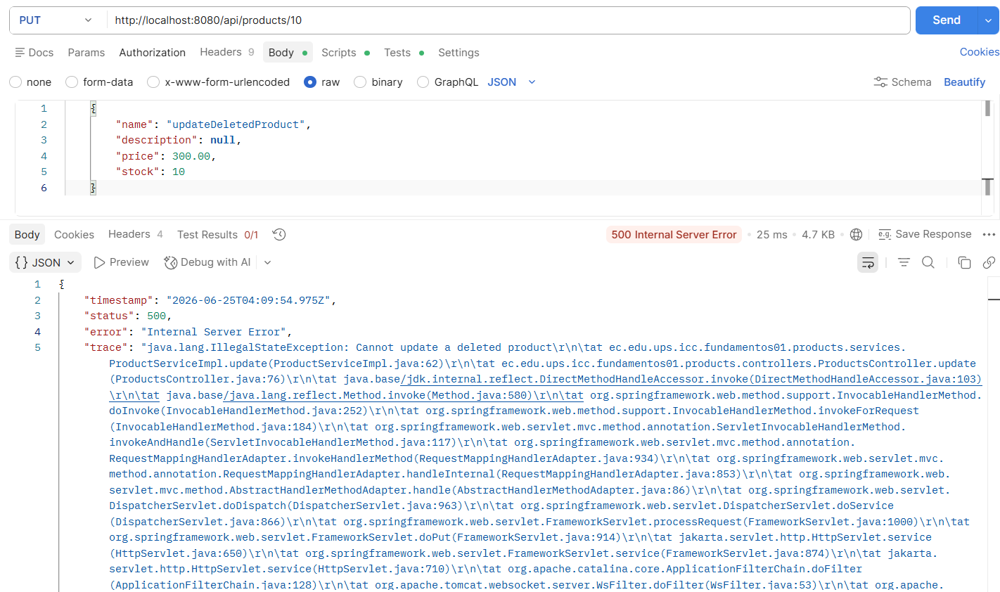

## 3. findAll no devuelve productos eliminados
- Listado de productos antes de eliminar


- Producto id 2 eliminado
- Lista de productos con findAll:
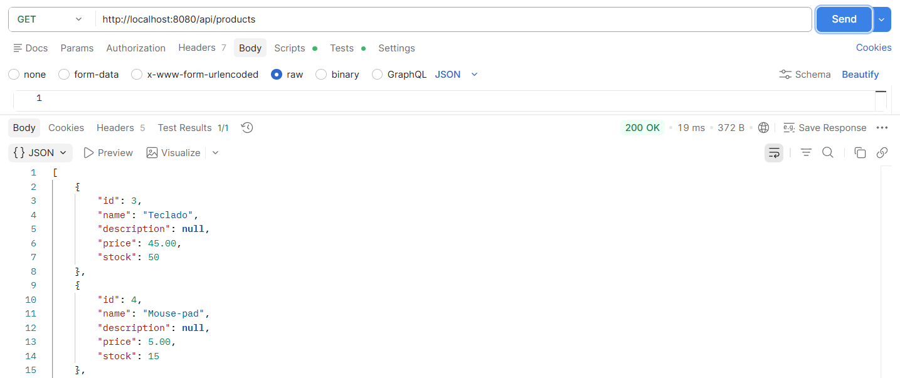

---
# Práctica 7 (Spring Boot): Manejo Global de Errores y Excepciones

## 1. Error por producto inexistente
Petición `GET /api/products/999`, con un id que no existe.
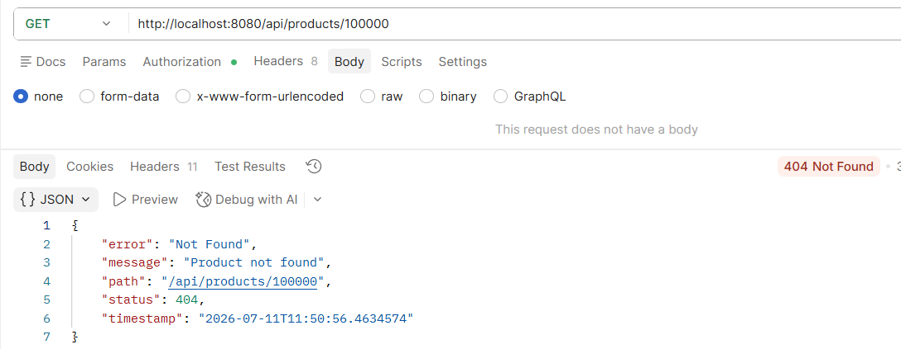

## 2. Error por validación de DTO
Petición `POST /api/products` con datos inválidos:
```json
{
  "name": "",
  "price": -5,
  "stock": -1
}
```
Respuesta `400 Bad Request` con el campo `details` listando cada error de campo.
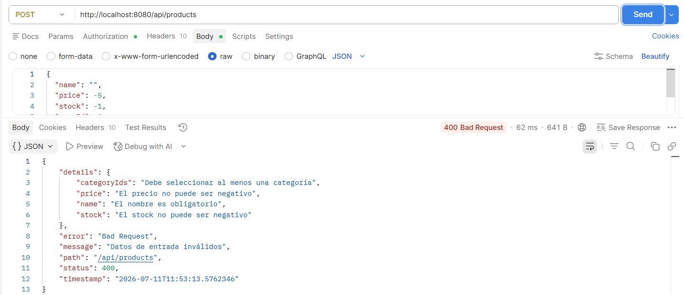

---
# Práctica 8 (Spring Boot): Relaciones ManyToOne, Foreign Keys y Consultas Relacionales

## 1. Descripción de la tabla products en PostgreSQL
Comando `\d products` en psql, mostrando la columna `user_id` como foreign key hacia `users`.
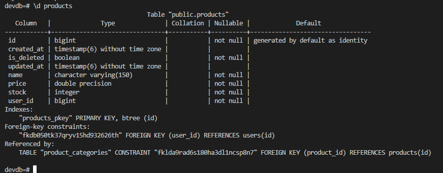

## 2. Creación de producto con relaciones
Respuesta de `POST /api/products` mostrando el objeto anidado `owner` y las fechas `createdAt`/`updatedAt`.

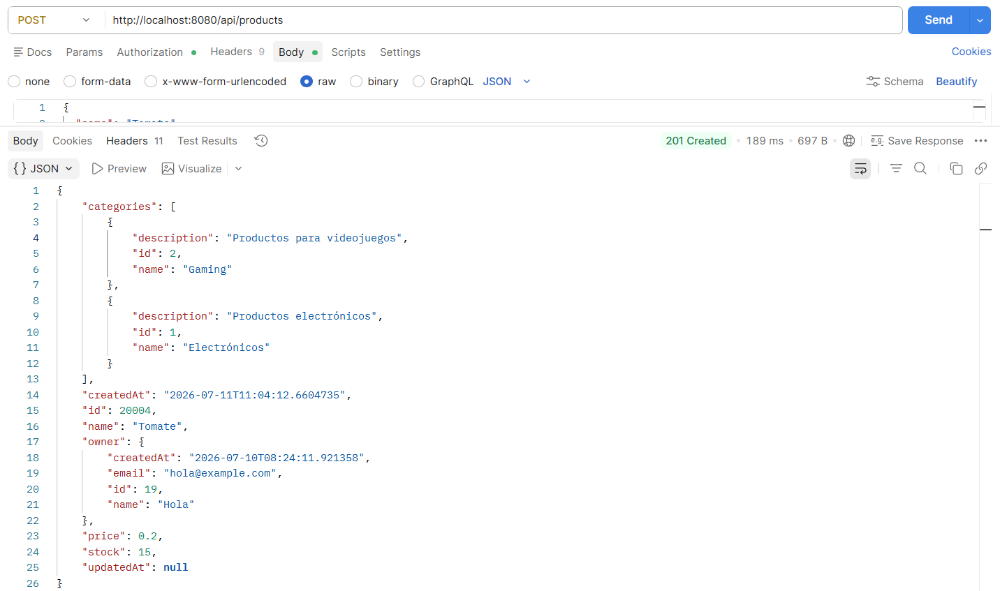

## 3. Consulta de productos por categoría
Petición `GET /api/products/category/1`.
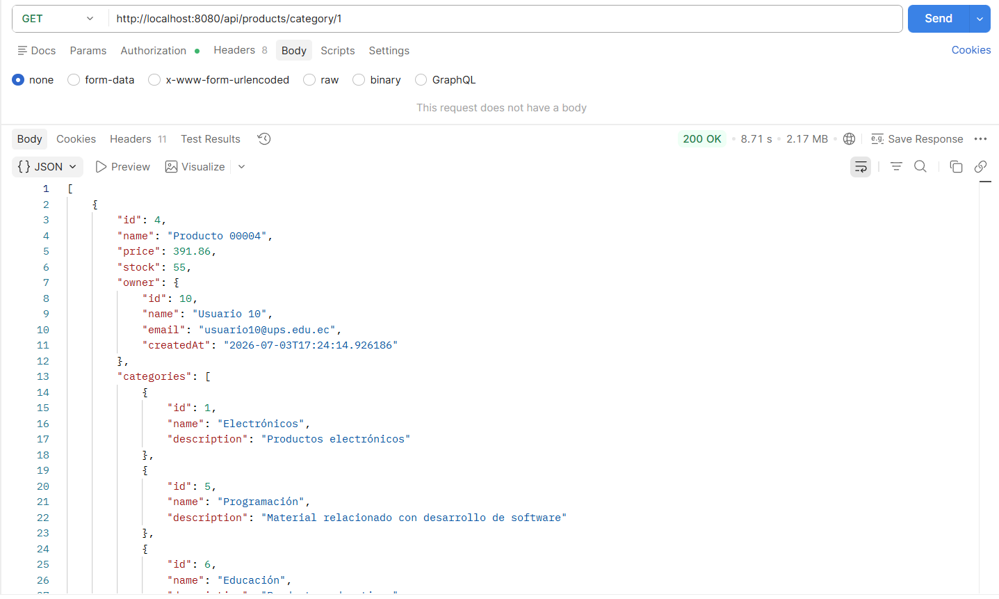

## 4. Explicación breve
### ¿Cómo se relaciona ProductEntity con UserEntity y CategoryEntity usando @ManyToOne y @JoinColumn?
`ProductEntity` tiene un campo `owner` anotado con `@ManyToOne` y `@JoinColumn(name = "user_id")`, que crea la foreign key `user_id` en la tabla `products` apuntando a `users`. Originalmente `categories` también era una relación `@ManyToOne` con `@JoinColumn`, pero en la Práctica 9 cambió a `@ManyToMany` con `@JoinTable("product_categories")`, porque un producto puede pertenecer a varias categorías.

---
# Práctica 9 (Spring Boot): Request Parameters, Consultas Relacionadas y Filtrado con JPA

## 1. Producto creado con varias categorías
Petición `POST /api/products`:
```json
{
  "name": "Laptop Gaming",
  "price": 1200.0,
  "stock": 5,
  "categoryIds": [1, 2, 3]
}
```

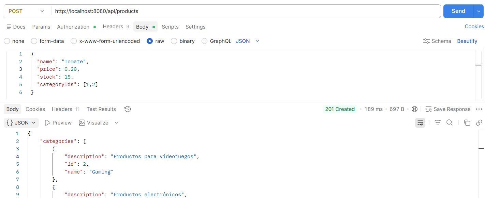

## 2. Consulta con filtros por usuario
Petición `GET /api/users/1/products?name=laptop&minPrice=500`.
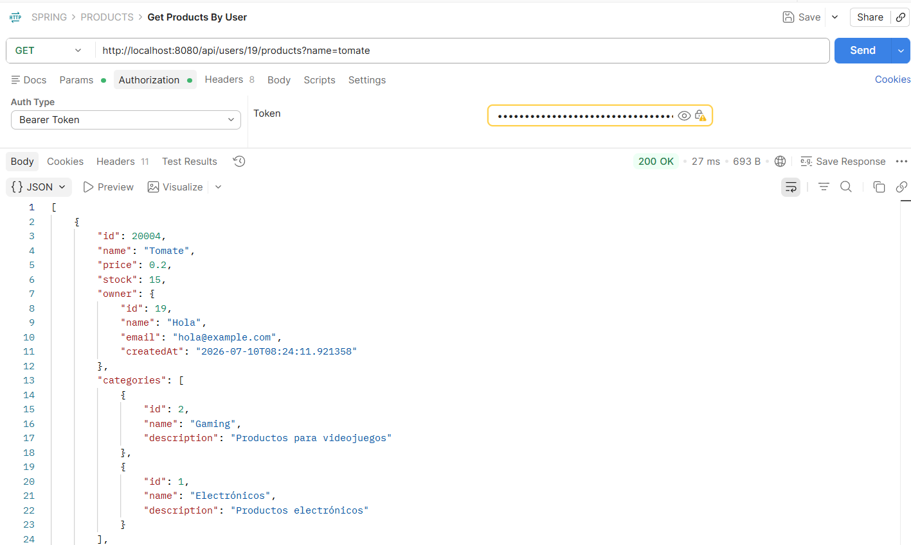

## 3. Consulta con filtros por categoría
Petición `GET /api/categories/2/products?userId=1`.
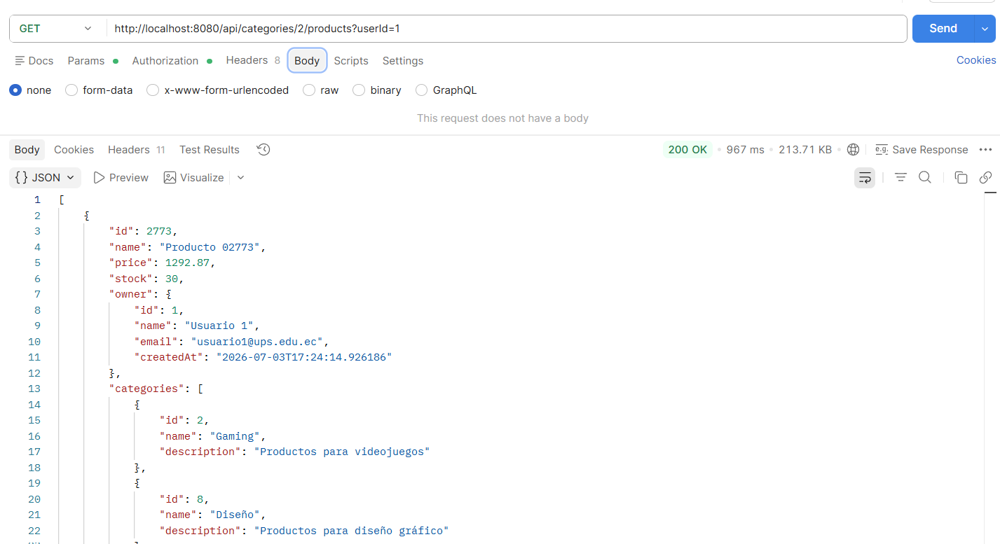

## 4. Explicación breve
### ¿Por qué se usa ProductService y ProductRepository para consultar productos aunque el endpoint esté dentro del contexto /users/{id}/products o /categories/{id}/products?
Porque el recurso que se está consultando sigue siendo `products`, solo que filtrado por usuario o por categoría. La ruta pertenece semánticamente a `users` o `categories`, pero la lógica y el acceso a datos le corresponden a `ProductService`/`ProductRepository`, así se evita duplicar lógica de productos en otros módulos.

### ¿Qué cambió al pasar de Product N ──── 1 Category a Product N ──── N Category?
La relación pasó de `@ManyToOne` (una categoría por producto, columna `category_id` en `products`) a `@ManyToMany` (`@JoinTable product_categories`), con un `Set<CategoryEntity> categories` en vez de un solo campo. Esto permitió que un producto tenga varias categorías y que `CreateProductDto`/`UpdateProductDto` reciban `categoryIds` como una lista en vez de un solo `categoryId`.

---
# Práctica 10 (Spring Boot): Paginación de Productos con Page, Slice y Pageable

## 1. Respuesta con Page
Petición `GET /api/products/page?page=0&size=5`, evidenciando `content`, `totalElements`, `totalPages`, `number`, `size`, `first` y `last`.
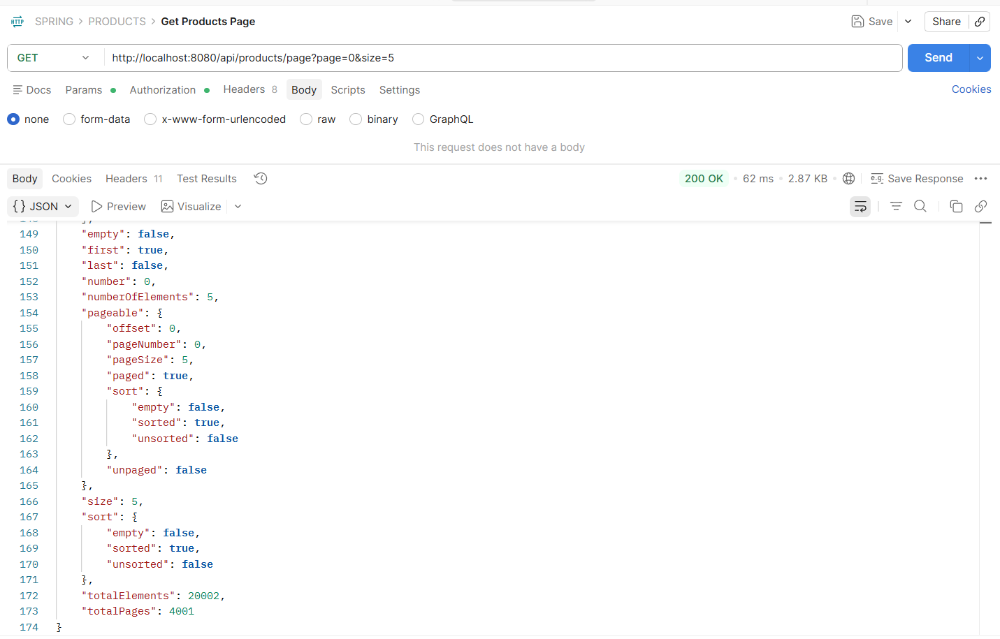

## 2. Respuesta con Slice
Petición `GET /api/products/slice?page=0&size=5`, evidenciando que no aparecen `totalElements` ni `totalPages`.
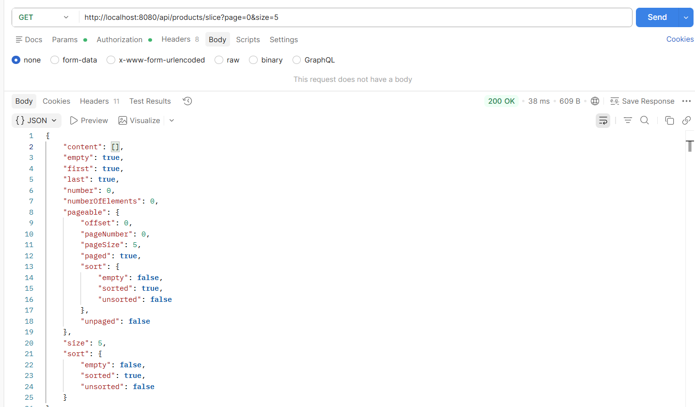

## 3. Error por paginación inválida
Petición `GET /api/products/page?page=-1&size=0`, respondiendo `400 Bad Request` con el formato estándar de `ErrorResponse` (incluye `details` con los errores de `page` y `size`).
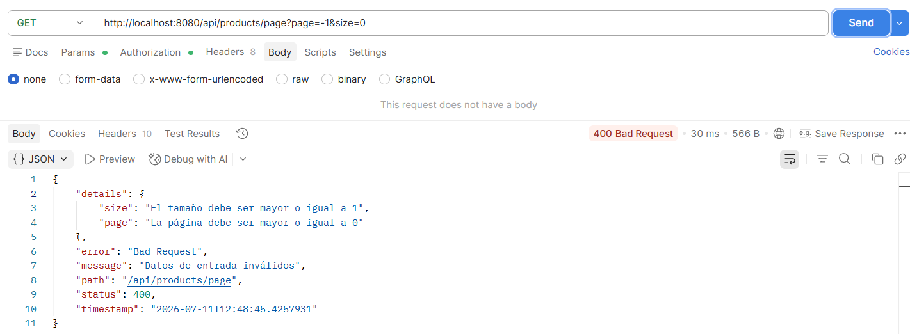

## 4. Endpoint de categoría paginado con Page
Petición `GET /api/categories/2/products/page?page=0&size=5`, evidenciando productos filtrados por categoría, paginación aplicada y metadatos de `Page`.
> **Nota:** el ejemplo original usa `page=110`, pero con pocos productos de prueba esa página estará vacía (`content: []`); usa `page=0` para ver resultados.


## 5. Endpoint de categoría paginado con Slice
Petición `GET /api/categories/2/products/slice?page=0&size=5`, evidenciando productos filtrados por categoría, paginación aplicada y metadatos de `Slice`.
> **Nota:** igual que arriba, usa `page=0` en vez de `page=10` si tu categoría tiene pocos productos, para que la captura muestre contenido real.
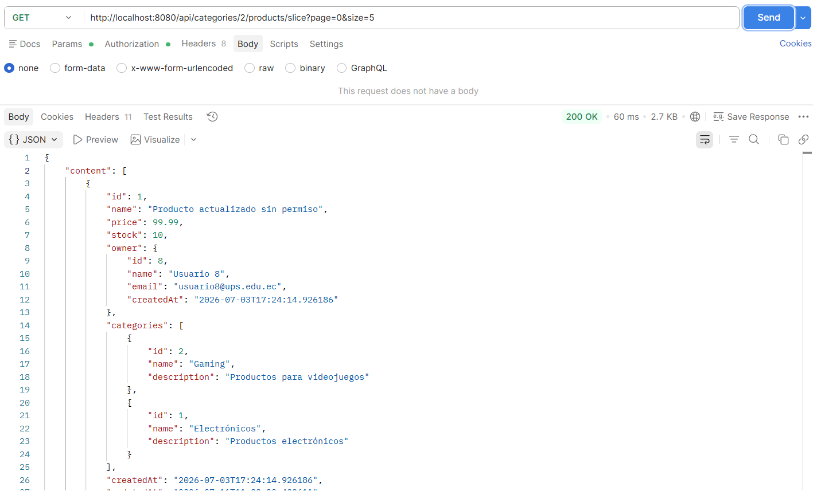

## 6. Explicación breve
### ¿Cuál es la diferencia entre Page y Slice? 
Page sabe el total de elementos y páginas (ejecuta un count extra), útil para mostrar "página 3 de 20". Slice solo sabe si hay página siguiente, sin contar el total; es más ligero e ideal para scroll infinito o "cargar más".

### ¿Por qué la paginación debe aplicarse en el repositorio y no después de traer todos los datos en memoria?
Porque paginar en el repositorio usa LIMIT/OFFSET para traer solo las filas necesarias. Traer todo a memoria y recortar después desperdicia tiempo, red y memoria, y se vuelve inviable cuando la tabla crece.

---
# Práctica 11 (Spring Boot): Autenticación JWT, Autorización por Roles y Protección de Endpoints

## 1. Captura de registro exitoso
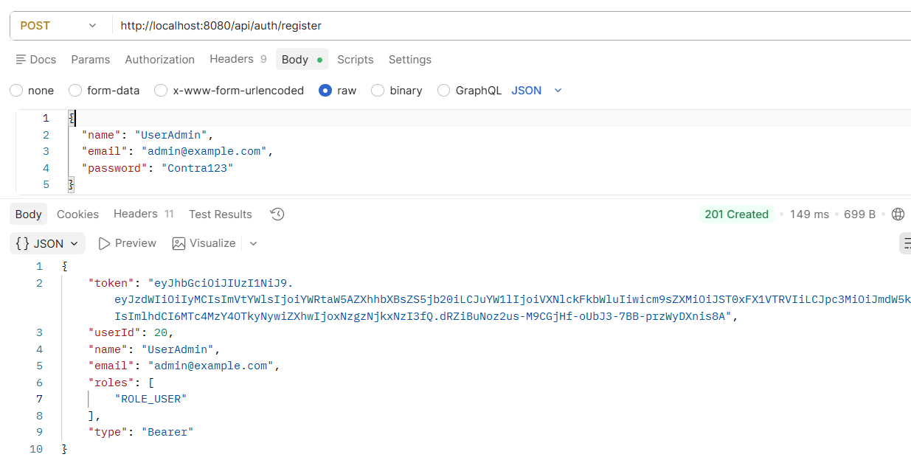

## 2. Captura de login exitoso
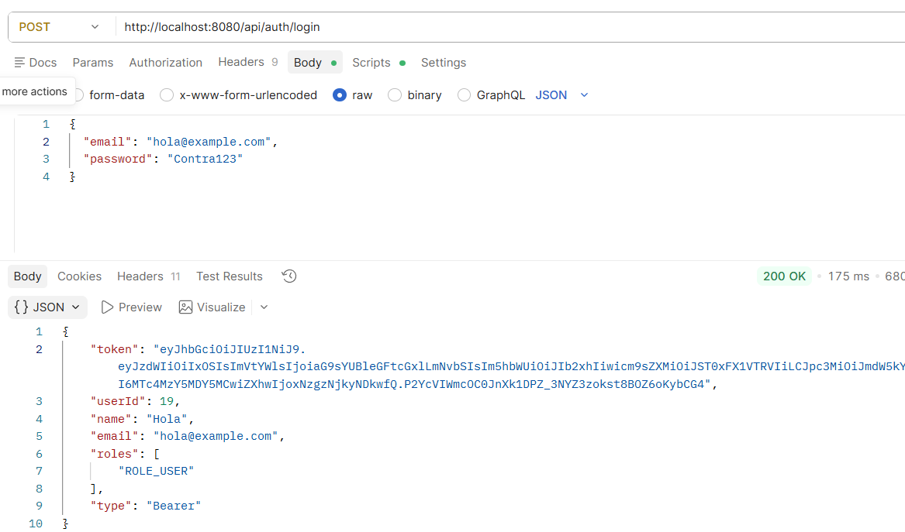

## 3. Captura de endpoint protegido sin token
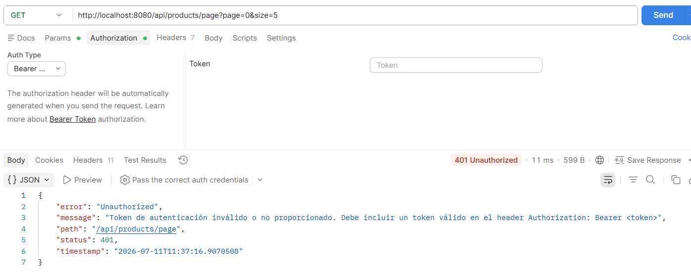

## 4. Captura de endpoint protegido con token
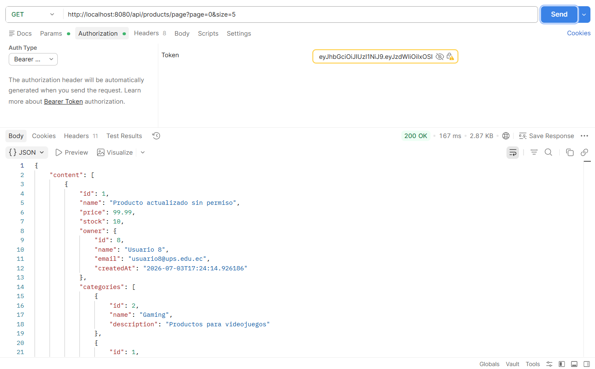
---
# Práctica 12 (Spring Boot): Protección de Endpoints con Roles

## 1. Captura de usuario autenticado
Endpoint `GET /api/users/me` consumido con el token de un usuario logueado, mostrando id, name, email y roles.
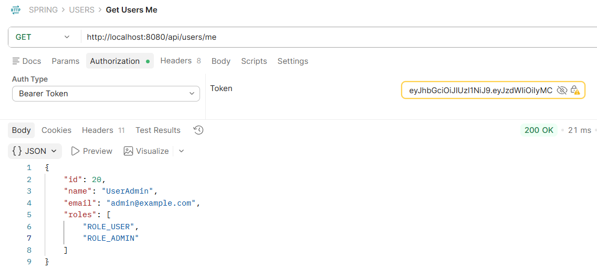

## 2. Captura de acceso denegado por rol
Endpoint `GET /api/products` consumido con un token `ROLE_USER`, respondiendo 403 Forbidden.
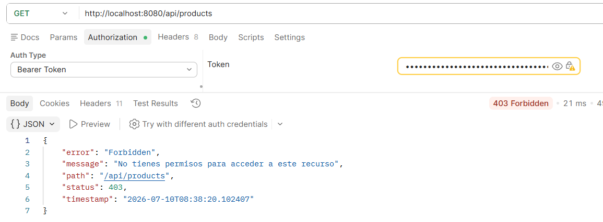

## 3. Captura de acceso permitido por rol ADMIN
Endpoint `GET /api/products` consumido con un token `ROLE_ADMIN`, respondiendo 200 OK.
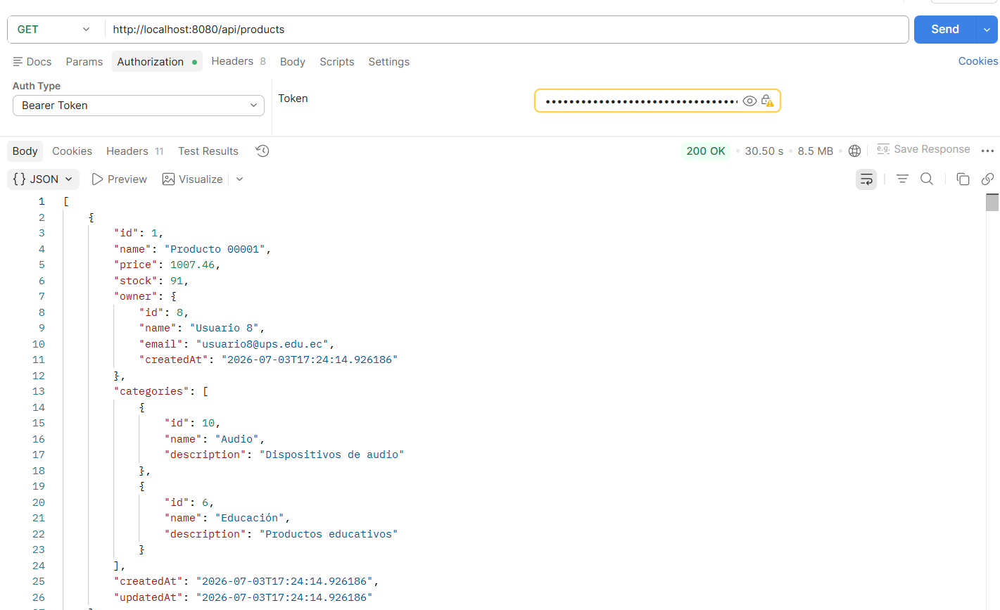

## 4. Explicación breve

### ¿Cuál es la diferencia entre autenticación y autorización?
La autenticación confirma quién es el usuario (token JWT válido). La autorización confirma qué puede hacer ese usuario ya autenticado, según el rol que tenga asignado.

### ¿Por qué GET /api/products debe ser solo para ADMIN, mientras GET /api/products/page puede ser consumido por cualquier usuario autenticado?
Porque `/products` devuelve todos los productos sin paginación, lo que puede exponer grandes volúmenes de datos y afectar el rendimiento. `/products/page` limita los resultados con Pageable, por lo que es seguro dejarlo disponible para cualquier usuario autenticado.

---
# Práctica 13 (Spring Boot): Validación de Propiedad de Recursos

## 1. Captura de creación de producto con usuario autenticado
Endpoint `POST /api/products`, sin enviar `userId` en el body. El owner del producto creado corresponde al usuario del token.


## 2. Captura de bloqueo por producto ajeno
Endpoint `PUT /api/products/{id}` usando el token de un usuario distinto al dueño.
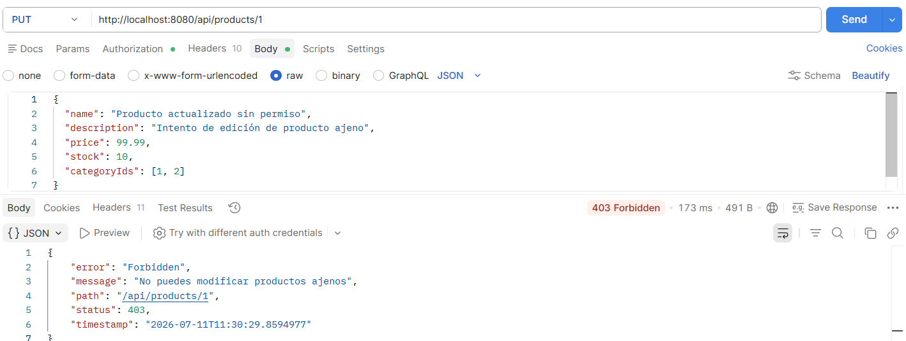

## 3. Captura de eliminación de producto ajeno bloqueada
Endpoint `DELETE /api/products/{id}` usando el token de un usuario distinto al dueño.
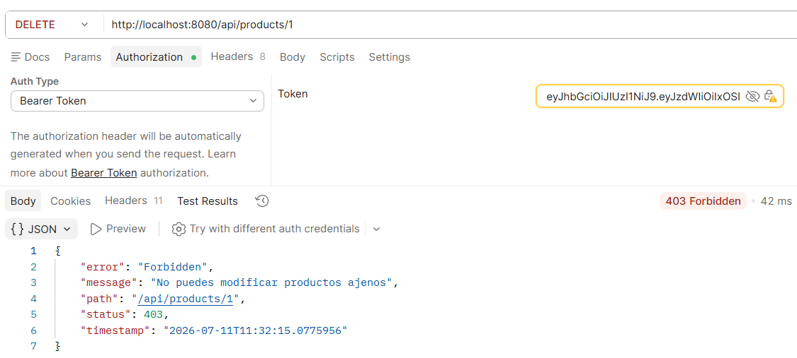

## 4. Captura de ADMIN modificando producto ajeno
Endpoint `PUT /api/products/{id}` usando un token `ROLE_ADMIN`, sobre un producto que no le pertenece.
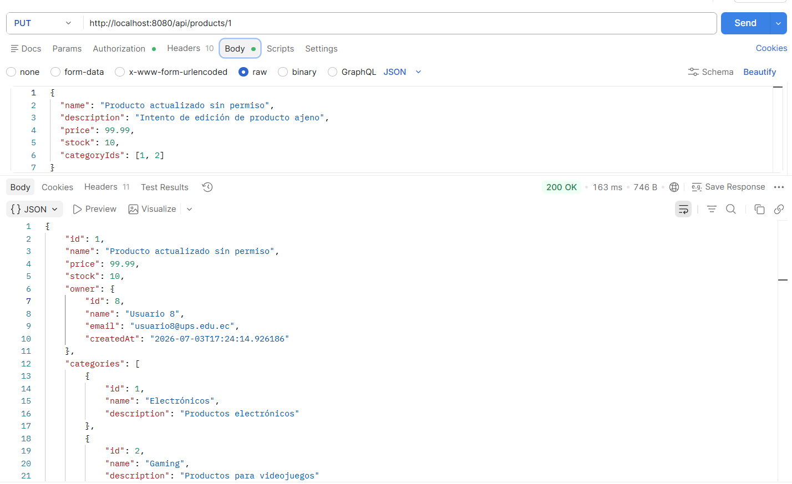

## 5. Explicación breve

### ¿Qué es ownership?
Es que un recurso tiene un dueño (en este caso, el usuario que creó el producto) y solo ese dueño, o un usuario con permisos especiales como ADMIN, puede modificarlo o eliminarlo. Tener token válido ya no es suficiente: también hay que ser el propietario del recurso o tener un rol que lo permita.

### ¿Por qué no es seguro recibir userId en CreateProductDto?
Porque si el `userId` viene en el body, cualquier usuario autenticado podría enviar el id de otra persona y crear productos a su nombre. Por eso el owner se obtiene del usuario autenticado (`@AuthenticationPrincipal`), no de lo que envía el cliente.

### ¿Cuál es la diferencia entre autorización por rol y autorización por ownership?
La autorización por rol valida qué puede hacer un usuario según el rol que tiene (`ROLE_ADMIN`, `ROLE_USER`), sin importar de quién sea el recurso; se resuelve con `@PreAuthorize` antes de llegar al método. La autorización por ownership valida si el usuario es el dueño del recurso específico que quiere modificar, y por eso se resuelve dentro del servicio, después de consultar el recurso en base de datos.
