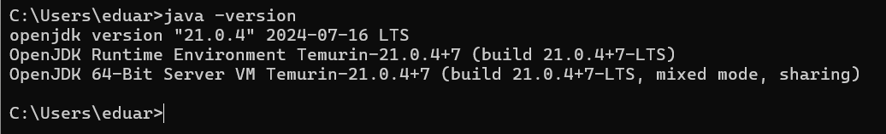

# Práctica 1: Spring Boot - Instalación, Configuración e Implementación del Primer Endpoint

**Asignatura:** Programación y Plataformas Web  
**Estudiante:** Verónica Cobos    
**Carrera:** Ingeniería en Ciencias de la Computación  

---
## 1. Captura de Verificación de Java

Salida del comando `java -version` verificando que Java 21 está instalado correctamente.

**Comando ejecutado:**
```bash
java -version
```

**Evidencia:**


---

## 2. Captura del Servidor Spring Boot Ejecutándose

Terminal mostrando que el servidor Tomcat se inició correctamente en el puerto 8080.

**Comando ejecutado:**
```bash
gradlew bootRun
```

**Evidencia:**


---

## 3. Captura del Endpoint `/api/status` Funcionando

Navegador mostrando la respuesta JSON del endpoint REST implementado.

**URL accedida:**
```
http://localhost:8080/api/status
```

**Evidencia:**  


---

## 4. Captura del Archivo StatusController.java Creado

Terminal mostrando que el archivo `StatusController.java` existe en la carpeta correcta.

**Comando ejecutado:**
```bash
ls ./src/main/java/ec/edu/ups/icc/fundamentos01/controllers/
```

**Evidencia:**


---

## 5. Explicación del Estudiante

### 5.1 ¿Qué entendiste sobre el funcionamiento del endpoint?

El endpoint `/api/status` es una URL que responde a peticiones HTTP de tipo GET. Cuando accedo a `http://localhost:8080/api/status` desde mi navegador, el servidor Spring Boot procesa la solicitud y devuelve una respuesta en formato JSON. Esta respuesta contiene:

- `service`: El nombre del servicio ("Spring Boot API")
- `status`: El estado actual del servidor ("running")
- `timestamp`: La fecha y hora exacta en que se realizó la consulta

La anotación `@GetMapping("/api/status")` en el controlador especifica que este método solo responde a peticiones GET en esa ruta específica.

---

### 5.2 ¿Cuál es la función general de Spring Boot en la creación del servidor?

Spring Boot simplifica enormemente la creación de servidores web en Java. Sus principales funciones son:

1. **Servidor embebido:** Spring Boot incluye automáticamente un servidor Tomcat dentro de la aplicación. No necesito instalar Tomcat por separado ni configurarlo manualmente. Cuando ejecuto `gradlew bootRun`, Tomcat se inicia automáticamente en el puerto 8080.

2. **Auto-configuración:** Spring Boot detecta automáticamente las dependencias que agregué (Spring Web, Spring Boot DevTools) y configura todo lo necesario sin que tenga que escribir código de configuración complejo en XML.

3. **Ejecución rápida:** Puedo iniciar la aplicación con un simple comando y tener un servidor HTTP funcional en segundos, listo para recibir peticiones.

4. **Desarrollo ágil:** Spring Boot DevTools permite que los cambios en el código se reflejen automáticamente sin reiniciar el servidor, acelerando el desarrollo.

Sin Spring Boot, tendría que: instalar Tomcat, configurarlo manualmente, desplegar archivos `.war`, reiniciar servicios, etc. Spring Boot elimina toda esa complejidad.

---

### 5.3 Anotaciones utilizadas (Opcional - Bonus)

**`@RestController`**
- Indica que la clase expone endpoints REST
- Combina `@Controller` y `@ResponseBody`
- Los métodos devuelven automáticamente JSON

**`@GetMapping("/api/status")`**
- Mapea peticiones HTTP GET a este método
- Define la ruta `/api/status`
- Solo responde a solicitudes GET, no POST, PUT, DELETE, etc.

---
## Notas

- Versión de Java utilizada: **21**
- Versión de Spring Boot: **4.1.0**
- Build Tool: **Gradle**
- Servidor embebido: **Tomcat 11.0.x**
- Puerto del servidor: **8080**

---
s